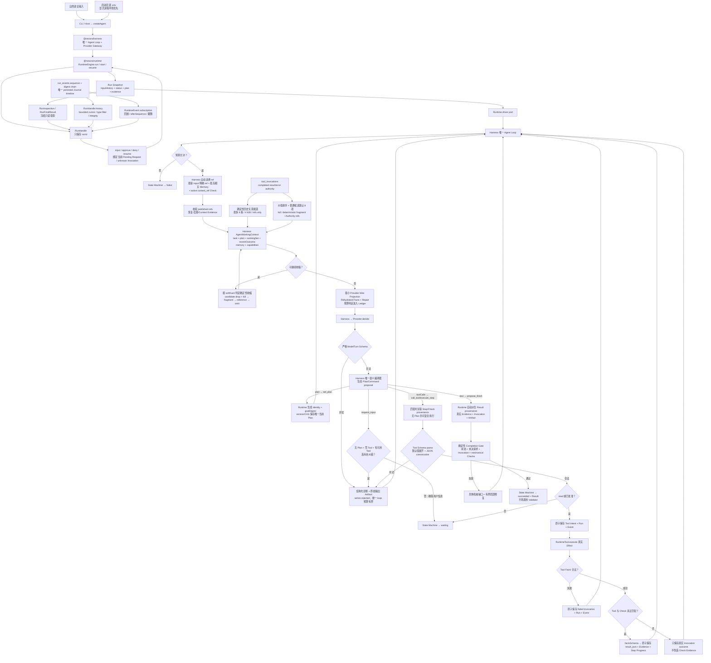
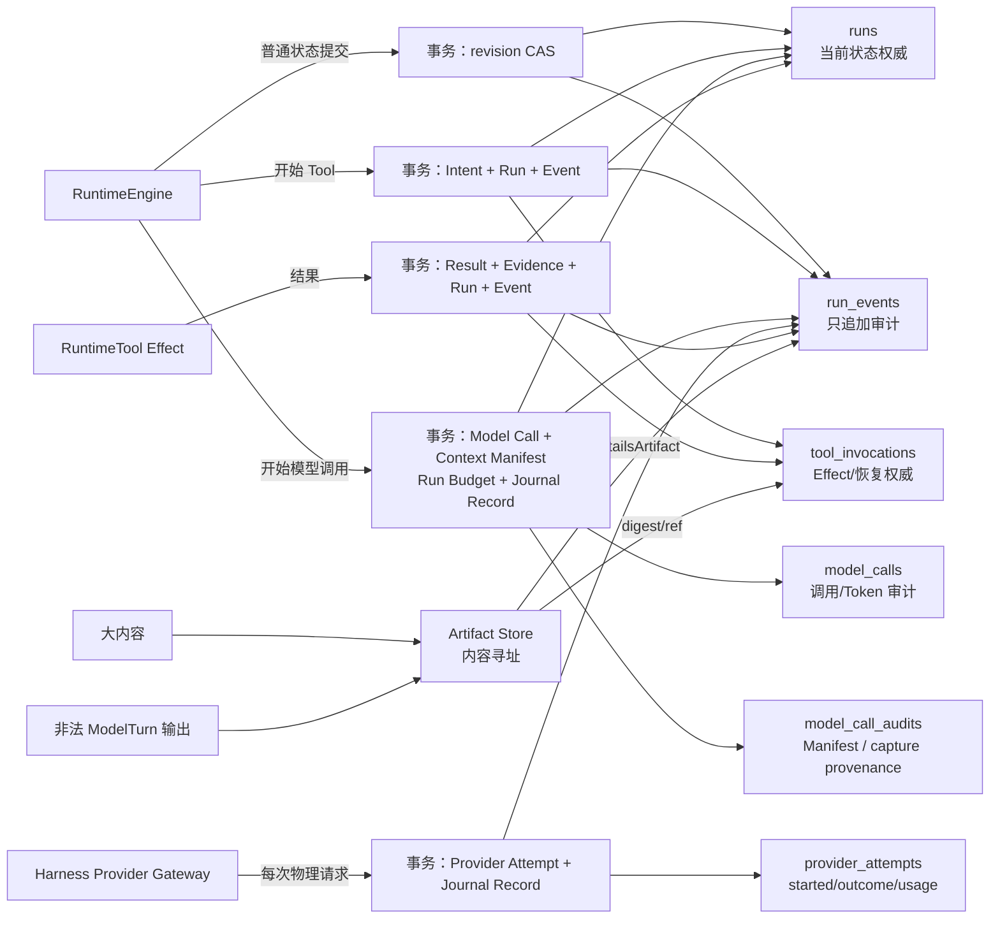
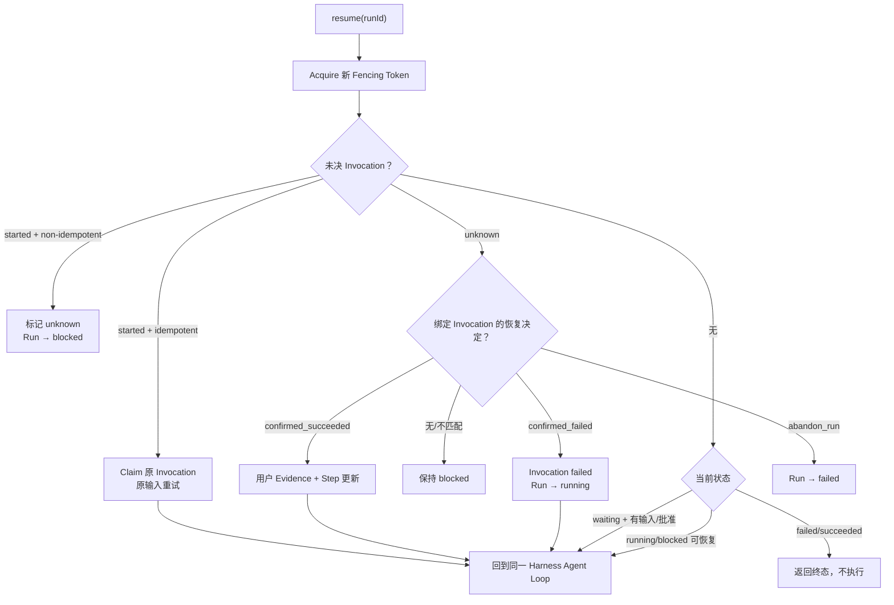

# 当前数据流与开发调试图

## 1. 主数据流



## 2. 权威与读写位置

| 数据 | 创建 | 修改 | 读取/消费 | 持久化/销毁 |
| --- | --- | --- | --- | --- |
| 自然语言输入 | CLI/调用方 | Resume 只追加 | Provider 决策、Task Contract | `runs.snapshot_json.inputHistory`；不改写 |
| RunHandle | `runtime.run/openRun` | 不修改，只持有 `runId` | Host 调用 inspect/wait/result/subscribe/input/approve/deny/resume/cancel | 进程内 façade；不保存 Snapshot、Pending Request、状态或完成结果 |
| RunInspection / RunFinalResult | Runtime 从当前 Snapshot、最后 Event sequence 和 Invocation 投影 | 深层冻结，不接受调用方修改 | 包外 Host | 每次读取重建；不持久化，不是 Authority |
| RuntimeEvent subscription | Runtime 从 `run_events.sequence` 投影 | cursor 只记录交付位置，不修改 Event 或 Run | 包外 Host listener | timer/notification 只唤醒读取；terminal/close 时清理，不是 Authority |
| CLI Provider 配置 | 启动目录 `.env` 或显式进程环境 | 不修改；显式环境优先 | CLI start/resume 创建 Provider | 只存在于进程环境；不读取目标 `--cwd`，不进入 Runtime/SQLite/Event/Artifact |
| Task Contract | Harness 从原始输入、可选 Plan goal 与 objective-only Tasks 派生，Runtime 补 workspace/version/inputVersion | Runtime 仅以 version/CAS 修订 | Plan digest、Harness Context、确定性完成边界 | Run snapshot；Zod 校验；不进入 Provider wire |
| Structured Plan | Harness 将有序 objective-only Tasks 编译为导航 Step，默认不生成 Acceptance Check；Runtime 生成 identity | Runtime CAS 修订并保留完成前缀 | 方向、provenance、Step；不是 Capability 白名单或完成证明 | Run snapshot 唯一当前版本 |
| Prompt Strategy | Host 选择 versioned Profile/Host Policy/Project Instructions，Harness 加入通用 Kernel、canonical Tool Schema 与单一 Transport | Compiler 固定语义优先级与 stable-prefix layout；Profile revision 必须显式 | Provider system/input/tools；只影响策略，不影响权限或完成 | 每次调用以 digest/manifest 写入 `model_call_audits.manifest_json.strategy`；正文按 capture policy |
| ModelTurn Contract | Harness 用单一显式 `action` 判别联合校验 `continue/request_input/finish` | 每轮独立、字段局部修复；普通文本不触发完成 | Provider 表达语义下一步；不得携带 Runtime-owned 字段 | 进程内只读数据；不是第二权威 |
| Context Budget | Harness 使用 Provider Model Profile + Provider-aware Token Meter | 每次 decision 调用前对最终 wire 重算 | Harness 触发确定性收缩并发送最小合法投影；预算判定不直接失败 Run | 通过 Runtime port 写 `model_calls`；不写回 Context/Run task facts |
| Context + Memory Benchmark | versioned scenario manifest + 生产 Adapter/Runtime + 本地确定性 Provider stub | runner 收集 Vitest 与持久化 Run/Evidence/Model Call 证据，缺失/failed/skipped 一律失败 | 验证 Eviction、恢复、完成与安全合同；不参与生产决策 | timestamped report；不是 Run、Context、Memory 或 Provider Authority，不能代替真实 Provider Eval |
| Model Call Ledger | Harness 在 Provider 调用前请求 Runtime 创建 logical call | Harness 报告 success/failure/cancel/interrupted/refused 与 usage，Runtime 持久化 | `runtime.inspect(runId).modelCalls`、成本/诊断 | `model_calls`；只拥有调用审计，不参与 Plan/Evidence/完成判断 |
| Context Manifest / Provider Attempt | Harness 从最终 Context、Prompt strategy 与 stable-prefix manifest 构造 refs/digests，并对每个物理 Provider 请求逐次报告实际 cache usage | Runtime 专用 port 持久化；进程接管把 started Attempt 标记 interrupted | `RunHandle.modelCallTrace(callId)`、Profile/Transport/cache/retry 审计 | `model_call_audits` / `provider_attempts`；从属于 logical call，不拥有任务状态 |
| Tool Capability Contract | Tool定义时必填五层结构 | Runtime构造时校验文本、example和Schema边界 | Model读取选择投影；Runtime读取Execution/Evidence内部字段 | 进程内静态metadata，不持久化 |
| Tool inputExample | `contract.execution` 定义 | 不修改；Runtime 构造时过 JSON + inputSchema | 所有已注册 Tool 的 Provider capability；Plan 不作为白名单 | 不单独持久化 |
| Tool Facts | Tool执行产生 | Runtime用`factsSchema`校验 | Invocation、Observation、Evidence、Completion provenance | 保存在既有`tool_invocations.result_json`；不建新表 |
| Canonical Tool input | Provider Capability arguments 经 Runtime 编译、Tool Schema parse/default expansion | protected resume 从 Pending Action 重校验 | Approval UI、Invocation、Tool execute | protected Action 在 Run Pending Request；执行后以 Invocation input 为权威 |
| 被拒绝 Provider 输出 | Provider 返回 | 不修改 | 下一轮有限分类修复、逆向审计 | 原始 JSON 进 Artifact；诊断/引用进 Event 与 lastError |
| Run Status | 初始 snapshot | 仅 State Machine | CLI、Resume、验收 | `runs.status` + snapshot |
| Tool Invocation | Runtime 生成 ID/digest/key/token | result/unknown/recovery 原子更新 | 恢复、Observation、完成门 | `tool_invocations` |
| Tool Observation | Harness 从 Runtime 提供的 completed Invocation 投影 | active Check/未解决错误/安全约束优先；稳定 tie-break；Token Meter 驱动收缩 | 下一轮 Provider 决策 | full/fragment/reference 都是可重建派生投影；8 项默认值、32 KiB 保险丝 |
| Evidence | 成功 Tool、用户恢复确认或 required `context_ref` 的精确恢复 | Plan 修订仅保留有效 Check 证据；大型 facts 绑定内容寻址 Artifact；计划外 Tool 结果生成绑定 Invocation 的 `run-unplanned` Evidence，不伪造 Plan Check | Step、Completion Gate、Result、Observation ref | Run snapshot，绑定 provenance/可选 Invocation/Artifact；历史 validator Evidence 只读且不参与新完成判断 |
| Finish provenance | Harness 从 `ModelTurn.text` 编译只含 summary 的 finish proposal；Runtime 从当前 Evidence、Invocation、Artifact 确定性派生 | Provider 不提供 ID；缺失、跨 Run、digest 漂移或未决 Effect 拒绝 | Runtime Completion Gate、Result、成功 Event | Gate 通过后与 Result 原子持久化；无第二次 Provider 调用 |
| Delivery | 成功时使用已验证模型文本；失败、取消或外部阻塞时从权威事实确定性派生 | 终态或外部阻塞时随 Run 持久化，不改变真实 status | CLI、Host、用户最终说明 | `RunSnapshot.delivery`；不能把部分工作标记为成功 |
| Event / Journal Record | Store 成功提交时追加 schema/actor/ref/payload/previous/record digest | 永不修改；旧记录明确 `legacy_partial` | observer、subscription、有界 history、完整性验证 | `run_events`；唯一过程时间线，不是 Run 状态源 |
| Artifact | 大内容按 SHA-256 创建 | 不修改；读取和审计校验重新计算 digest | Tool result/ref、允许捕获的脱敏审计正文、人工审计 | `.nexora/artifacts` |
| Lease/Fencing | start/resume acquire | 操作前及长调用中 renew | 所有写事务校验 | `runs` lease 列；release 清空 |

## 3. 四表与事务边界



事务原则：Tool Intent 与结果分成两个事务，使进程中断后能够区分“尚未开始”“结果明确”和“结果未知”；Model Call 的开始与 Context Manifest、Run model-call budget/Journal 原子写入。Harness 的机械重试逐次创建 Provider Attempt，Provider Adapter 本身不重试；进程接管把未完成 call/Attempt 标为 interrupted。任何 Ledger、Attempt、Journal 行或孤立 Artifact 都不能改变任务事实或自行完成 Run。

## 4. Resume 与恢复流




## 5. 开发时如何使用数据流图

1. 在图上标出症状最后出现的节点。
2. 向上游找到最后一个已持久化的权威事实。
3. 比较下一节点所需输入与实际 snapshot/Event/Invocation。
4. 在该边界写 RED；不要在下游增加补偿状态。
5. 修复后同时验证正向路径和 Resume/失败分支，确保没有第二个真相源。

`ModelTurn`、`AgentWorkingContext`、公共 Inspection 和 Runtime Event 都是从权威数据重新投影的对象，不能反写 Run。Harness 在交给 Provider 前解除投影与 Run/Tool Contract 的对象引用并递归冻结。RunHandle 只保存 `runId`，活跃 Promise/AbortController map 只协调当前执行段，subscription cursor 只协调交付；它们都不保存状态或判断完成。取消必须由 State Machine 持久化 `cancelled`，未知非幂等 Effect 仍由 Invocation/Recovery 决定 blocked。Model Call Ledger 由 Runtime 持久化，但记录内容由 Harness 的 Provider Gateway 提交；它不保存或覆盖 Context 内容，也不参与完成判断。

Tool Observation 采用同一原则：`tool_invocations.result_json/error_json` 保留完整 Tool Authority。价值 class 依次覆盖 active Check、未解决错误、安全/审批失败和 predecessor Evidence，同 class 使用 `stepOrder → invocationSequence → invocationId`。大型 success/failure payload 都以 canonical JSON 计算 digest 并写入 Artifact；Invocation 保存 payload provenance，只有合法绑定同一成功 Invocation 的既有 Evidence 才引用该 Artifact。critical 大 payload 保留明确标记的固定 fragment，普通大 payload 转 reference。Provider soft token limit 会触发继续收缩并重测；32 KiB 仅作保险丝。任何 fragment/reference 都不能冒充完整 facts。

Rehydration 是确定性 Context 收缩之前由 Harness 完成的精确恢复层，恢复结果随后与其他投影一起接受统一收缩。Harness 从 Runtime port 读取 Invocation/Evidence/Input/Event/Fork facts，并从独立 Memory Store 读取 exact-scope Memory，构建 `availableContextRefs` 后执行 scope、digest、预算和去重校验。最新输入点名的已发布 ref、active `context_ref` Check、最高相关 eligible Memory 与关键 Tool facts 可自动触发恢复；匹配 required Check 时，Harness 请求 Runtime 原子写入 Run-owned Context Evidence，它只证明恢复过程，不提升 Memory 内容的信任级别。最终 OpenAI-compatible Wire Projection只保留当前需要的 `rehydratedFacts`、workingSet 与 finite typed `repair.issues`；`historyCandidates`、`memoryCandidates` 和 Session Archive 不进入生产 wire。

用户输入投影始终保留全部原始文本，并以 `{ sequence, text }` 的稳定顺序进入 Provider Context；`TaskContract.inputVersion` 只表示当前 Contract 基于哪个输入版本，不能作为隐藏旧输入的覆盖边界。投影不暴露 Input ID、接收时间、Run revision、Budget、Pending Request 或 Result。`inputCount` 始终表示持久化输入总数，模型修订 Task Contract 时必须使用它。

Tool capability 与 input 也不建立第二权威：description/inputExample 都来自已注册 `RuntimeTool`，所有注册能力每轮可见，Plan 不过滤 Tool；description 有 240 字符上限。真正执行 input 只由 Tool 自身 Zod Schema 生成，protected Pending Action 保存默认值已展开的 canonical JSON；resume 不信任内存缓存，重新 parse 后才创建 Invocation。

完成投影同样不持久化第二份状态：finish proposal 只携带 summary，Runtime 在 Completion Gate 中从 `RunSnapshot.evidence`、同 Run Invocation 和 Artifact Authority 派生引用。objective-only Plan 的导航 Step 不制造机械门槛；Host/Tool 已声明的 required mechanical Check、started/unknown Invocation、Pending Request 或损坏 provenance 仍会阻塞。通过后 Result 与 `run.succeeded` 使用同一组自动派生引用；进程退出后仍可从 Result、Evidence 与 Event 反向重建。

E055 搜索数据流不创建新 authority：canonical Tool input 从 Pending/Invocation 进入同一个 `filesystem.search`，workspace `path` 先经边界校验；Ripgrep 只产生进程内 JSON 事件，映射为有界、排序的 `matches/truncated` 后写入原 Invocation result。原始 stdout 随函数返回销毁，不入新表；后续 Provider observation、Evidence 与 finish hard gate 仍从 Invocation/Run 权威读取。

E058 的生产流为 `全部 inputHistory → 可选模型 Plan → Runtime 结构/权限执行 → Invocation/Evidence → deterministic Completion Gate`。TaskContract/Plan 不能隐藏原始输入；安全 Effect 始终由 risk/Approval 确定性控制。

E059 结果显示流现在为 `propose_finish.summary → Completion Gate → RunSnapshot.result.summary → toRunResult只读投影 → Runtime调用方/CLI JSON`。创建、验证和持久化仍只有一份 Result；`summary` 没有在 CLI 复制、修改或销毁，未产生 Result 时投影为 `null`。

E119 删除了 E060 的同步 semantic payload、Verdict 和 validator Evidence 生产路径。旧 Run 中的 validation Event、validation phase Model Call 和 validator Evidence 继续由历史 Schema 只读解析，但不能触发新 Provider 调用或满足新 Run 的 Completion Gate。

E061工具流为`注册时五层Contract校验 → Model读取选择投影 → active inputExample → Runtime inputSchema/canonical Action → Tool执行单一Capability → success factsSchema → 原tool_invocations.result_json → Evidence/Observation`。数据库列未改名或迁移；`result_json`仍是持久化权威，`facts`是运行时语义名称。非法Facts转为failed Invocation且不产生Evidence。

E062–E064 的交互语义在 D2 收敛为 `CLI/Host → agent.run/openRun → RunHandle.wait/subscribe → input/approve/deny/resume → Runtime driver → 同一 Harness Agent Loop`。人工等待不进入活跃段 Duration；拒绝原因同时进入 Approval Event、lastError 和 inputHistory，下一轮 Task Contract/Decision 从同一输入权威读取。CLI 不复制 continuation authority，没有 Feedback Store。

D3 取消语义收敛为 `Host cancel/Runtime close → active AbortSignal coordination → Invocation 明确结果或 unknown Recovery boundary → State Machine cancelled/blocked → persisted Event/Result`。signal、Promise 和 subscription 均不拥有 Run 状态或完成判断；started non-idempotent Effect 结果未知时必须保留 blocked/Recovery。

D4 不增加新数据流：`defineProviderAdapter(single completion) → Harness Provider Gateway`，`defineTool(definition) → RuntimeTool → runtime execution`，`createAgentHarness → production createAgent → real temporary runtime-v1.1.db`。Adapter request、Builder context 和 Scripted Provider descriptor 都是有界进程内输入；Testing Kit 只读取公共 Event/Error/Result Contract，不提供 Snapshot authority。

E091 建立一条与 Run 执行完全分离的数据流：`Host stateDir + exact scope identity → openMemoryStore → MemoryRecord Schema → <stateDir>/memory-v1.db`。Memory Store 自己拥有 Memory Record 的 create/status/delete 生命周期，来源必须保留 `{sourceRunId, ref, digest}`；它不打开或迁移 `runtime-v1.1.db`，也不反写 Run、Plan、Invocation、Evidence 或 State Machine。相同 scope/ID 的相同 create digest 返回现有记录，不同内容拒绝；get/list/status/delete 的 SQL 谓词始终包含 user/project/workspace/branch 全部 scope。当前 Context 数据流尚不消费 Memory，后续召回必须经过新的有界投影 Feature。

E092 把 Memory 内容演进收敛为单一事务流：`candidate → explicit/verified promote → active`；同 scope 的 exact type/statement/sensitivity 重复会变成 `candidate → superseded → existing active`。更新和合并都走 `new candidate + 1..32 active predecessors → one SQLite transaction → active replacement + superseded predecessors + bidirectional lineage`，不原地改 statement/source/scope/ID。缺失或非 active predecessor、未验证的 verified promotion、未改变内容、scope 错误、时间倒退和并发 record drift 都在首个 Store 边界失败并回滚，不产生部分 lineage。`expire` 只处理 exact scope 内已到期的 candidate/active，`revalidate` 只更新 eligible candidate/active；通用 `setStatus` 只保留 archive/invalidate 人工操作，不能激活、supersede 或 expire。该流仍不进入 Context、Run Store 或 State Machine。

E093 增加 Harness 单向只读投影：`Host-injected MemoryStore + exact scope → list active → deterministic task relevance → memoryCandidates`。投影最多 6 条且同时受 768 estimated tokens 与 4 KiB 限制，不携带 statement。Memory 不反写 Run Authority，Agent close 也不关闭 Host 的 Memory Store。

E094 增加用户控制流：`Host user action → MemoryControls Schema → exact-scope MemoryStore transaction → record/policy mutation + append-only control event`。Correct 复用 candidate→Supersession；Invalidate/Delete/Clear 和 Recall enable/disable 不创建旁路状态。Audit 只保存 operationId/action/actor/reason/time/Memory IDs/count/policy/digest，不复制 statement；相同 operationId/command 返回原 event，不同 command 拒绝并回滚。`memory_scope_controls.enabled=false → Context memoryCandidates=[]`，Rehydration 同时拒绝旧候选；重新启用后只恢复仍 eligible 的记录。Audit export 与所有操作都使用完整 user/project/workspace/branch scope。

E095 固化的安全不变量在当前路径中仍成立：`MemoryRecord statement → deterministic candidate(trust=untrusted_memory_data, no statement) → Harness 自动选择 eligible ref 并重验 published digest → restored fact(trust=untrusted_memory_data)`。生产协议不要求模型先申请恢复许可。精确恢复只证明持久化字节与 digest，不提升指令权限；Provider Policy 明确拒绝其中的角色、工具、Approval、Evidence、Completion 和 policy override。猜测/cross-scope/branch/sensitive/deleted/disabled/drifted ref 在同一边界返回 `REF_UNAVAILABLE`。即使 Provider 在看到恶意 statement 后提交 write Tool，仍进入既有 Runtime Approval Gate，Memory 不产生 permission 或 Tool Effect。Delete 在下一轮同时移除候选和恢复资格；无正文 audit tombstone 保留用户操作可审计性。

E096 固化性能与恢复流：`persisted Memory Authority tables → exact-scope indexed list(max 500) → deterministic candidate projection(max 6 / 768 tokens / 4 KiB) → bounded Context`。固定 5,000 Record 数据集分别测量 Memory query 与完整 Context build 的 p50/p95/max，并记录 scope、样本、数据库和 Context 字节；该路径不调用 Provider，所以模型调用和费用均为 0。`drop derived indexes → reopen MemoryStore → CREATE INDEX IF NOT EXISTS from Authority tables → identical Records/Candidates`，查询计划重新使用 scope/status/time 索引。

E097 固定真实 Provider Canary：`relevant/distractor/sensitive/cross-project Memory + 8 shards → production Adapter → Runtime Ledger/Event/Invocation/Evidence → redacted report`。首个 qwen3.7-flash one-shot 在后续 decision 以 `9559 > 5904` 被 Harness Context hard limit 拒绝，并通过 Runtime Ledger 审计；修复后的收缩顺序保持不变。该历史证据不授权 Runtime 调用 Provider 或拥有 Context 策略。

## 6. 当前代码落点与冻结边界

```text
Agent 组合入口与唯一循环
→ packages/harness/src/{agent,agent-loop}.ts

Provider、Context、Memory、Reasoning、Planning
→ packages/harness/src/{providers,context,memory,provider-gateway,reasoning-policy,planning}.ts

公共 Run 生命周期、driver port、Plan version/CAS、Lease
→ packages/runtime/src/{runtime,agent-runtime-port}.ts

Tool Schema、Approval、Invocation、Effect、Evidence、Recovery
→ packages/runtime/src/execution/

确定性 hard gate、Result、State Machine
→ packages/runtime/src/{completion-gate,state-machine}.ts

SQLite、Revision、事务、Migration、Lease/Fencing
→ packages/runtime/src/store/
```

Harness 只通过 `@nexora/runtime` 和 `@nexora/runtime/internal` ports 使用机械 Authority；Runtime 禁止导入 Harness、Provider、Memory 或 Provider-facing Context。两个 tarball 分别发布，外部消费者必须同时验证 Harness 的 `.`/`./testing` 与 Runtime 的 `.`/`./internal` exports。

平行公开 Action API 和 Plan+首批 read 组合协议仍处于关闭 gate；现有 `RuntimeEngine`/`RunHandle`、scripted Provider、production Provider Adapter 和 Bench Runner 继续复用同一循环与 Authority 链。

`runtime-public.ts` 只投影并冻结 `RunInspection`/`RunFinalResult`；`result()` 必须先读取 State Machine 的 `failed/succeeded` 终态，waiting/blocked 不产生 Final。该 façade 不拥有持久化 Authority。

`runtime-events.ts` 只从 `RunStore.listEventsAfter()` 读取 persisted sequence 并投影 `schemaVersion: 1` Event。notification/interval 只触发重新读取；listener memory、cursor 和 subscription terminal 判断不能写 Run，也不能替代 State Machine。Handle 控制先绑定当前 Pending Request 或 unknown Invocation，再通过同一 Lease/Fencing 和 `RuntimeEngine.resume()` 进入原执行、Evidence、Recovery 与 Completion 路径。
