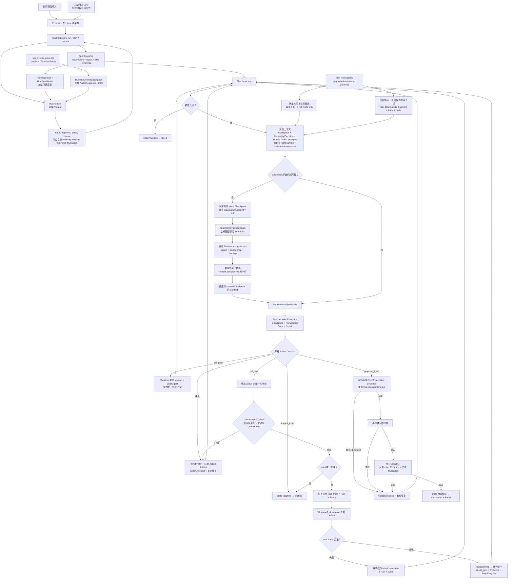
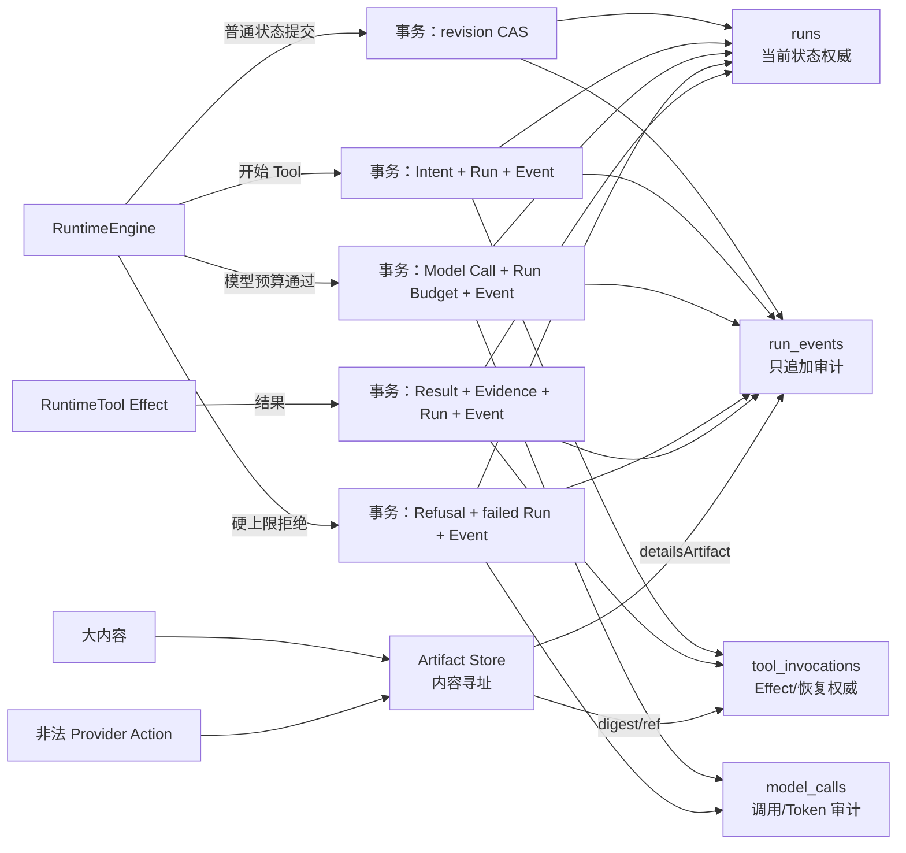
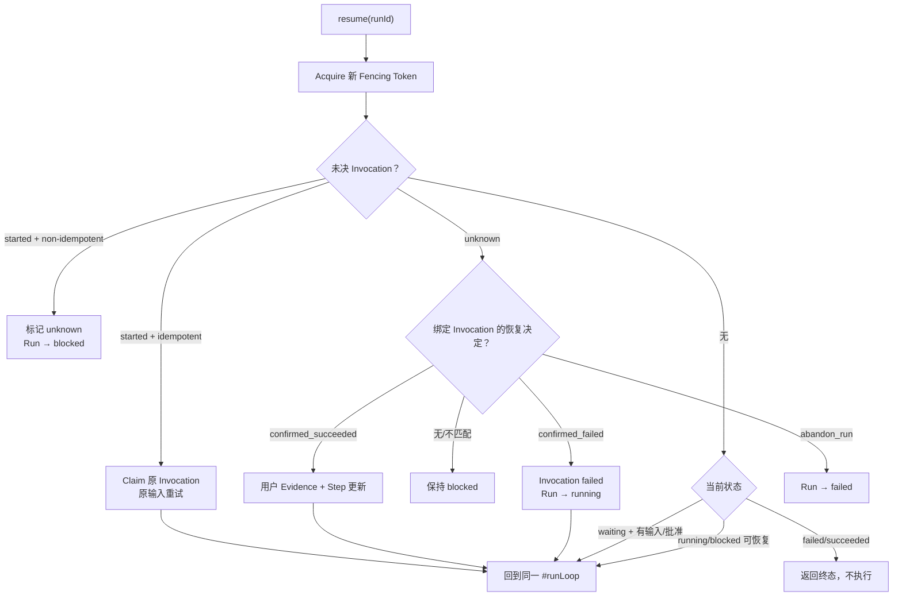

# 当前数据流与开发调试图

## 1. 主数据流



## 2. 权威与读写位置

| 数据 | 创建 | 修改 | 读取/消费 | 持久化/销毁 |
| --- | --- | --- | --- | --- |
| 自然语言输入 | CLI/调用方 | Resume 只追加 | Provider、验证 | `runs.snapshot_json.inputHistory`；不改写 |
| RunHandle | `runtime.run/openRun` | 不修改，只持有 `runId` | Host 调用 inspect/wait/result/subscribe/input/approve/deny/resume/cancel | 进程内 façade；不保存 Snapshot、Pending Request、状态或完成结果 |
| RunInspection / RunFinalResult | Runtime 从当前 Snapshot、最后 Event sequence 和 Invocation 投影 | 深层冻结，不接受调用方修改 | 包外 Host | 每次读取重建；不持久化，不是 Authority |
| RuntimeEvent subscription | Runtime 从 `run_events.sequence` 投影 | cursor 只记录交付位置，不修改 Event 或 Run | 包外 Host listener | timer/notification 只唤醒读取；terminal/close 时清理，不是 Authority |
| CLI Provider 配置 | 启动目录 `.env` 或显式进程环境 | 不修改；显式环境优先 | CLI start/resume 创建 Provider | 只存在于进程环境；不读取目标 `--cwd`，不进入 Runtime/SQLite/Event/Artifact |
| Task Contract | 首次 `set_plan` 候选 | 仅新输入时版本化 | Plan digest、Provider、验证 | Run snapshot；Zod 校验 |
| Structured Plan | Model 提议，Runtime 生成 identity | CAS 修订，完成步骤不可改 | Action 授权、Step、完成门 | Run snapshot 唯一当前版本 |
| Provider Action Contract | Runtime 从 Zod Schema、Run 状态和 Tool 定义投影 | 每轮随 Plan/Input/active Step 重建 | Provider 决策 | 进程内只读数据；不是第二权威 |
| Context Budget | Provider Model Profile + Provider-aware Token Meter | 每次 decision/validation 调用前重算 | Runtime 硬拒绝或允许 Provider 调用 | 决策写入 `model_calls`；不写回 Context/Run task facts |
| Model Call Ledger | Runtime 在 Provider 调用前创建 logical call | success/failure/cancel/interrupted/refused 与实际 usage 终结 | `runtime.inspect(runId).modelCalls`、成本/诊断 | `model_calls`；只拥有调用审计，不参与 Plan/Evidence/完成判断 |
| Tool Capability Contract | Tool定义时必填五层结构 | Runtime构造时校验文本、example和Schema边界 | Model读取选择投影；Runtime读取Execution/Evidence内部字段 | 进程内静态metadata，不持久化 |
| Tool inputExample | `contract.execution`定义 | 不修改；Runtime构造时过JSON + inputSchema | 仅active Step可调用Tool的Provider context | 不单独持久化 |
| Tool Facts | Tool执行产生 | Runtime用`factsSchema`校验 | Invocation、Observation、Evidence、semantic validation | 保存在既有`tool_invocations.result_json`；不建新表 |
| Canonical Tool input | Provider Action 经 Tool Schema parse/default expansion | protected resume 从 Pending Action 重校验 | Approval UI、Invocation、Tool execute | protected Action 在 Run Pending Request；执行后以 Invocation input 为权威 |
| 被拒绝 Action | Provider 返回 | 不修改 | 下一轮修复、逆向审计 | 原始 JSON 进 Artifact；诊断/引用进 Event 与 lastError |
| Run Status | 初始 snapshot | 仅 State Machine | CLI、Resume、验收 | `runs.status` + snapshot |
| Tool Invocation | Runtime 生成 ID/digest/key/token | result/unknown/recovery 原子更新 | 恢复、完成门、语义验证 | `tool_invocations` |
| Tool Observation | Runtime 从当前 Run completed Invocation 投影 | active Check/未解决错误/安全约束优先；稳定 tie-break；Token Meter 驱动收缩 | 下一轮 Provider 决策 | full/fragment/reference 都是可重建派生投影；8 项默认值、32 KiB 保险丝 |
| Evidence | 成功 Tool、用户恢复确认，或 required `context_ref` 的精确恢复 | Plan 修订仅保留有效证据；大型 facts 绑定内容寻址 Artifact；Context Evidence 只证明 ref 恢复，不证明内容为真 | Step、验证、Result、Observation ref | Run snapshot，绑定 Plan/Step/Check/可选 Invocation/Artifact |
| Finish Evidence 引证 | Provider `propose_finish` 提议，Runtime 解析 | 不修改；缺失/重复/未知/部分覆盖均拒绝 | 确定性完成、语义验证、Result、成功 Event | `validation.requested/passed` 与 Result 保存同一 ID 集；不是第二 Evidence Store |
| Event | Store 成功提交时追加 | 永不修改 | observer、inspect、审计 | `run_events`；不是状态源 |
| Artifact | 大内容按 SHA-256 创建 | 不修改 | Tool result/ref、人工审计 | `.nexora/artifacts` |
| Lease/Fencing | start/resume acquire | 操作前及长调用中 renew | 所有写事务校验 | `runs` lease 列；release 清空 |

## 3. 四表与事务边界



事务原则：Tool Intent 与结果分成两个事务，使进程中断后能够区分“尚未开始”“结果明确”和“结果未知”；Model Call 的开始与 Run model-call budget/Event 原子写入，硬拒绝与 failed Run 原子写入，进程中断后的 started call 会在下次持 Lease 时标为 interrupted。任何 Ledger 行或孤立 Artifact 都不能改变任务事实或自行完成 Run。

## 4. Resume 与恢复流




## 5. 开发时如何使用数据流图

1. 在图上标出症状最后出现的节点。
2. 向上游找到最后一个已持久化的权威事实。
3. 比较下一节点所需输入与实际 snapshot/Event/Invocation。
4. 在该边界写 RED；不要在下游增加补偿状态。
5. 修复后同时验证正向路径和 Resume/失败分支，确保没有第二个真相源。

Provider Action Contract、`ProjectedRunContext`、公共 Inspection 和 Runtime Event 都是从权威数据重新投影的对象，不能反写 Run。Decision Projection 在交给 Provider 前解除与 Run/Tool Contract 的对象引用并递归冻结。RunHandle 只保存 `runId`，活跃 Promise/AbortController map 只协调当前执行段，subscription cursor 只协调交付；它们都不保存状态或判断完成。取消必须由 State Machine 持久化 `cancelled`，未知非幂等 Effect 仍由 Invocation/Recovery 决定 blocked。Model Call Ledger 是独立持久化的调用审计：它引用 Run 和 projection digest，但不保存或覆盖 Context 内容，不是 Task Contract、Plan、Invocation、Evidence、Artifact 或 Run Status 的 Authority。`context_checkpoints` 是独立持久化的 Prompt 派生缓存：每条 `context_checkpoint` 行都携带 plan_version、revision、canonical summary digest 和按 sourceRef 捕获的 Source Digest 映射；Checkpoint 只引用既有 Authority 实体，从不改写 Run 或 Model Call，删除全部 Checkpoint 后 Decision Projection 必须从 Authority 确定性重建。

重复 Compaction 不建立 Checkpoint 链或第二套历史。首次调用向 Provider 传 `previousCheckpoint: null`；后续调用只传 latest 且已完整重验的 `{ digest, summary }`，不传 checkpoint ID、Source Digest map 或 covered Invocation list。Provider 必须结合当前 `run/toolObservations` 输出一份完整替代 Summary，不能嵌套旧 Summary，也不能引用 Checkpoint ID/digest；Runtime 从原始 Authority 重新校验每条 ref 和 section，重新派生 canonical Summary digest、完整 Source Digest map 与 covered Invocation multiset。failed/unknown Invocation 若已被同 Plan/Step/Check 的后续成功 Invocation 解决，就不能继续进入 `unresolvedIssues`。全部通过后，Store 在同一事务中删除旧 Checkpoint 并插入唯一新行；失败输出不改变有效缓存。该缓存参与后续 Prompt，但不能反写 TaskContract、Plan、Invocation、Evidence、Approval、Run Status 或 Completion。

Tool Observation 采用同一原则：`tool_invocations.result_json/error_json` 保留完整 Tool Authority。价值 class 依次覆盖 active Check、未解决错误、安全/审批失败和 predecessor Evidence，同 class 使用 `stepOrder → invocationSequence → invocationId`。大型 success/failure payload 都以 canonical JSON 计算 digest 并写入 Artifact；Invocation 保存 payload provenance，只有合法绑定同一成功 Invocation 的既有 Evidence 才引用该 Artifact。critical 大 payload 保留明确标记的固定 fragment，普通大 payload 转 reference。Provider soft token limit 会触发继续收缩并重测；32 KiB 仅作保险丝。任何 fragment/reference 都不能冒充完整 facts。

Rehydration 是 Eviction/Compaction 之后的按需恢复层：`request_context` 是 Harness 控制动作（不属于 Core RuntimeAction，不进 state-machine 与 `#handleAction`），模型用它请求恢复本轮已公开的 sourceRef。Runtime 构建 `availableContextRefs`（本轮 `toolObservations.sourceRefs` ∪ `contextCheckpoint.summary` refs ∪ `historyCandidates` refs/relatedRefs ∪ `run.evidence` refs ∪ 当前 Run 的 Input/Event sequence 范围 → digest），下一轮把恢复的原始内容以 `rehydratedFacts` 注入；未公开 / 跨 Run / digest 漂移统一返回 `REF_UNAVAILABLE`（不泄露对象真实性），格式错误返回 `INVALID_REF`，准入预算拒绝返回 `REHYDRATION_BUDGET_EXCEEDED`。如果 active Step 有 ref 精确匹配的 required `context_ref` Check，Runtime 在成功恢复后把 `{kind: context_ref, source: context, subjectRef, digest}` 原子写入 Run Evidence 并重算 Step Progress；它只证明恢复过程，不提升 Memory 内容的信任级别。`historyCandidates` 只从当前 Run 与显式 Fork Base 派生最多 8 条、4 KiB 的关系导航，按同 Check、Step、Tool、精确 Input、路径、错误码、Evidence/Artifact、Approval 与 Fork Base 解释排序，不自动注入候选正文。`sessionArchive` 继续提供 Input/Event 时间导航。Harness 自动恢复按 `harness_required` → `model_request` → `harness_helpful` 优先级准入，候选本身不改变该优先级。请求通过 `context.rehydrate_requested` / `context.rehydrated` 事件对进行崩溃恢复，不新增权威表；恢复事实持续到合法后续 Action 被接受，重复 ref 请求幂等。最终 OpenAI-compatible Wire Projection 必须保留 `contextCheckpoint`、`rehydratedFacts`、`historyCandidates` 和 `repair`，但继续移除 `projection` 及 Observation retention/digest 等 Runtime-only provenance；任何 Eviction 重建也只能收缩 Observation，不能删除这些当前决策字段。

用户输入投影使用 `TaskContract.inputVersion` 作为覆盖边界：`sequence <= inputVersion` 的原文继续只保存在 `RunSnapshot.inputHistory`，Provider 读取当前 Task Contract；更大的 sequence 以 `{ sequence, text }` 进入 `ProjectedRunContext.inputHistory`，不暴露 Input ID、接收时间、Run revision、Budget、Pending Request 或 Result。`inputCount` 始终表示持久化输入总数，模型修订 Task Contract 时必须使用它，而不是可见输入数组长度。Semantic Validation 仍直接读取完整原始输入，不受 Decision Projection 裁剪影响。

Tool capability 与 input 也不建立第二权威：description/inputExample 都来自已注册 `RuntimeTool`；description 每轮可见但有 240 字符上限，inputExample 仅 active callable Tool 可见。真正执行 input 只由 Tool 自身 Zod Schema 生成，protected Pending Action 保存默认值已展开的 canonical JSON；resume 不信任内存缓存，重新 parse 后才创建 Invocation。

完成投影同样不持久化第二份状态：finish IDs 只在 `validateCompletion` 中解析到 `RunSnapshot.evidence`，随后同一 ID 集进入 semantic Context、validation Event、Result 和成功转换。进程退出后，可从 Result 与 Event 反向重建这条引证链。

E055 搜索数据流不创建新 authority：canonical Tool input 从 Pending/Invocation 进入同一个 `filesystem.search`，workspace `path` 先经边界校验；Ripgrep 只产生进程内 JSON 事件，映射为有界、排序的 `matches/truncated` 后写入原 Invocation result。原始 stdout 随函数返回销毁，不入新表；后续 Provider observation、Evidence、finish 与验证仍从 Invocation/Run 权威读取。

E058 需求流为 `inputHistory → 模型TaskContract/Plan → Runtime结构/权限执行 → Invocation/Evidence → 对照全部inputHistory的semantic validation`。Runtime不创建第二份自然语言需求投影；semantic失败复用原循环修订Plan，安全Effect仍由risk/Approval确定性控制。

E059结果显示流为 `propose_finish.summary → semantic validation → RunSnapshot.result.summary → toRunResult只读投影 → Runtime调用方/CLI JSON`。创建、验证和持久化仍只有一份Result；`summary`没有在CLI复制、修改或销毁，未产生Result时投影为`null`。

E060验证流为 `全部inputHistory + proposedSummary + cited Evidence关联Invocation → 进程内plain facts → semantic verdict(passed/issues)`。facts和verdict不持久化第二份Evidence authority；成功仍使用`validateCompletion`产生的Evidence IDs进入validation Event、Result和State Machine，facts在调用后销毁。

E061工具流为`注册时五层Contract校验 → Model读取选择投影 → active inputExample → Runtime inputSchema/canonical Action → Tool执行单一Capability → success factsSchema → 原tool_invocations.result_json → Evidence/observation/semantic facts`。数据库列未改名或迁移；`result_json`仍是持久化权威，`facts`是运行时语义名称。非法Facts转为failed Invocation且不产生Evidence。

E062–E064 的交互语义在 D2 收敛为 `CLI/Host → runtime.run/openRun → RunHandle.wait/subscribe → input/approve/deny/resume → 同一 Runtime.resume/#runLoop`。人工等待不进入活跃段 Duration；拒绝原因同时进入 Approval Event、lastError 和 inputHistory，下一轮 Task Contract/Decision/semantic validation 从同一输入权威读取。CLI 不再复制 continuation authority，没有 Feedback Store。

D3 取消语义收敛为 `Host cancel/Runtime close → active AbortSignal coordination → Invocation 明确结果或 unknown Recovery boundary → State Machine cancelled/blocked → persisted Event/Result`。signal、Promise 和 subscription 均不拥有 Run 状态或完成判断；started non-idempotent Effect 结果未知时必须保留 blocked/Recovery。

D4 不增加新数据流：`defineProviderAdapter(single completion) → existing RuntimeProvider.decide/validate`，`defineTool(definition) → existing RuntimeTool → runtime-execution.callTool`，`createRuntimeHarness → production createRuntime → real temporary runtime-v1.1.db`。Adapter 的 request、Builder context 和 Scripted Provider descriptor 都是有界进程内输入，不持久化 Run 状态、不提交内部 Action、不生成 Evidence 或完成结论；Schema、Approval、Invocation、Evidence、Recovery、Validation 和 State Machine 仍沿用上述唯一链路。Testing Kit 只读取公共 Event/Error/Result Contract，close 后删除测试 workspace；它不自动打开 Memory Store，也不提供 Snapshot authority。

E091 建立一条与 Run 执行完全分离的数据流：`Host stateDir + exact scope identity → openMemoryStore → MemoryRecord Schema → <stateDir>/memory-v1.db`。Memory Store 自己拥有 Memory Record 的 create/status/delete 生命周期，来源必须保留 `{sourceRunId, ref, digest}`；它不打开或迁移 `runtime-v1.1.db`，也不反写 Run、Plan、Invocation、Evidence 或 State Machine。相同 scope/ID 的相同 create digest 返回现有记录，不同内容拒绝；get/list/status/delete 的 SQL 谓词始终包含 user/project/workspace/branch 全部 scope。当前 Context 数据流尚不消费 Memory，后续召回必须经过新的有界投影 Feature。

E092 把 Memory 内容演进收敛为单一事务流：`candidate → explicit/verified promote → active`；同 scope 的 exact type/statement/sensitivity 重复会变成 `candidate → superseded → existing active`。更新和合并都走 `new candidate + 1..32 active predecessors → one SQLite transaction → active replacement + superseded predecessors + bidirectional lineage`，不原地改 statement/source/scope/ID。缺失或非 active predecessor、未验证的 verified promotion、未改变内容、scope 错误、时间倒退和并发 record drift 都在首个 Store 边界失败并回滚，不产生部分 lineage。`expire` 只处理 exact scope 内已到期的 candidate/active，`revalidate` 只更新 eligible candidate/active；通用 `setStatus` 只保留 archive/invalidate 人工操作，不能激活、supersede 或 expire。该流仍不进入 Context、Run Store 或 State Machine。

E093 增加单向只读投影：`Host-injected MemoryStore + exact scope → list active → deterministic task relevance → memoryCandidates`。投影只携带 ref/type/reason/hint/source/verification/lifecycle/sensitivity/record digest，最多 6 条且同时受 768 estimated tokens 与 4 KiB 限制，不携带 statement。`request_context(memory:<id>) → exact-scope get → active/expiry/sensitivity/digest recheck → rehydratedFacts(kind=memory)`；删除、错误 scope、生命周期或 digest 漂移统一 `REF_UNAVAILABLE`。Memory 不反写 Run Authority，Runtime close 也不关闭 Host 的 Memory Store。

E094 增加用户控制流：`Host user action → MemoryControls Schema → exact-scope MemoryStore transaction → record/policy mutation + append-only control event`。Correct 复用 candidate→Supersession；Invalidate/Delete/Clear 和 Recall enable/disable 不创建旁路状态。Audit 只保存 operationId/action/actor/reason/time/Memory IDs/count/policy/digest，不复制 statement；相同 operationId/command 返回原 event，不同 command 拒绝并回滚。`memory_scope_controls.enabled=false → Context memoryCandidates=[]`，Rehydration 同时拒绝旧候选；重新启用后只恢复仍 eligible 的记录。Audit export 与所有操作都使用完整 user/project/workspace/branch scope。

E095 固化 Memory 安全流：`MemoryRecord statement → deterministic candidate(trust=untrusted_memory_data, no statement) → request_context + published digest → restored fact(trust=untrusted_memory_data)`。精确恢复只证明持久化字节与 digest，不提升指令权限；Provider Policy 明确拒绝其中的角色、工具、Approval、Evidence、Completion 和 policy override。猜测/cross-scope/branch/sensitive/deleted/disabled/drifted ref 在同一边界返回 `REF_UNAVAILABLE`。即使 Provider 在看到恶意 statement 后提交 write Tool，仍进入既有 Runtime Approval Gate，Memory 不产生 permission 或 Tool Effect。Delete 在下一轮同时移除候选和恢复资格；无正文 audit tombstone 保留用户操作可审计性。

E096 固化性能与恢复流：`persisted Memory Authority tables → exact-scope indexed list(max 500) → deterministic candidate projection(max 6 / 768 tokens / 4 KiB) → bounded Context`。固定 5,000 Record 数据集分别测量 Memory query 与完整 Context build 的 p50/p95/max，并记录 scope、样本、数据库和 Context 字节；该路径不调用 Provider，所以模型调用和费用均为 0。`drop derived indexes → reopen MemoryStore → CREATE INDEX IF NOT EXISTS from Authority tables → identical Records/Candidates`，查询计划重新使用 scope/status/time 索引。

E097 固定真实 Provider Canary：`relevant/distractor/sensitive/cross-project Memory + 8 shards → production Adapter → Runtime Ledger/Event/Invocation/Evidence → redacted report`。首个 qwen3.7-flash one-shot 正确请求并恢复目标 Memory、错误召回 0、完成 8/8 read、无越权 Tool，但在后续 decision 以 `9559 > 5904` 被 Runtime 硬拒绝。逆向定位为两个 `harness_helpful` Invocation 原文（约 16 KiB）不参与 Eviction；修复后收缩顺序为 `drop rebuildable harness_helpful facts → full/fragment/reference/drop Observations`。首次真实失败保留且不重跑，因此修复只有确定性完整链证据，真实 Provider 验收仍为 blocked。

## 6. 当前代码落点与冻结边界

```text
输入、Resume、单一循环、Plan、Context、Lease
→ packages/runtime/src/runtime.ts

Approval、Invocation Intent/Result、Tool Effect、Evidence、Recovery
→ packages/runtime/src/runtime-execution.ts

finish 引证、确定性验证、语义验证、Result、succeeded
→ packages/runtime/src/validation.ts

SQLite 四表、Revision、事务、Migration、Lease/Fencing
→ packages/runtime/src/run-store.ts

Provider Profile、Token Meter fallback、软/硬预算计算
→ packages/runtime/src/context-budget.ts

Run Status 合法迁移
→ packages/runtime/src/state-machine.ts

独立 Memory Contract、scope、provenance 与 SQLite 生命周期
→ packages/runtime/src/memory/
```

`runtime-types.ts` 只定义类型和 Schema，`runtime-helpers.ts` 只保存无状态纯函数；二者都不拥有持久化 Authority。当前结构不再按文件行数拆分。性能修改必须先建立 SQL、Context 或模型调用的可重复基线，并证明瓶颈位于对应边界。

`runtime-public.ts` 只投影并冻结 `RunInspection`/`RunFinalResult`；`result()` 必须先读取 State Machine 的 `failed/succeeded` 终态，waiting/blocked 不产生 Final。该 façade 不拥有持久化 Authority。

`runtime-events.ts` 只从 `RunStore.listEventsAfter()` 读取 persisted sequence 并投影 `schemaVersion: 1` Event。notification/interval 只触发重新读取；listener memory、cursor 和 subscription terminal 判断不能写 Run，也不能替代 State Machine。Handle 控制先绑定当前 Pending Request 或 unknown Invocation，再通过同一 Lease/Fencing 和 `RuntimeEngine.resume()` 进入原执行、Evidence、Recovery 与 Completion 路径。
