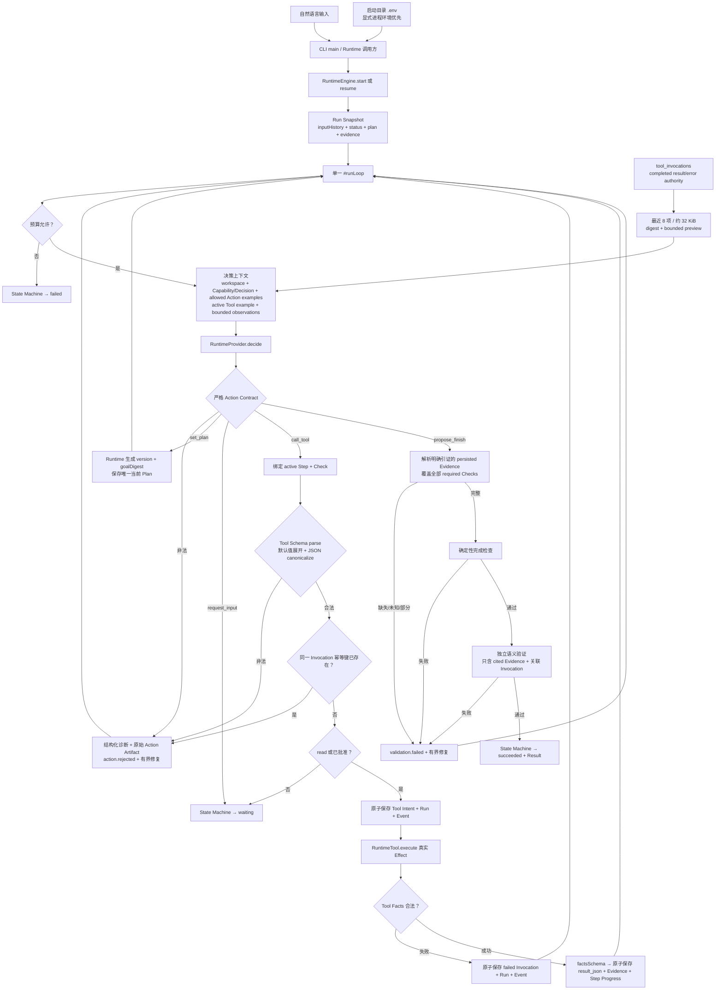
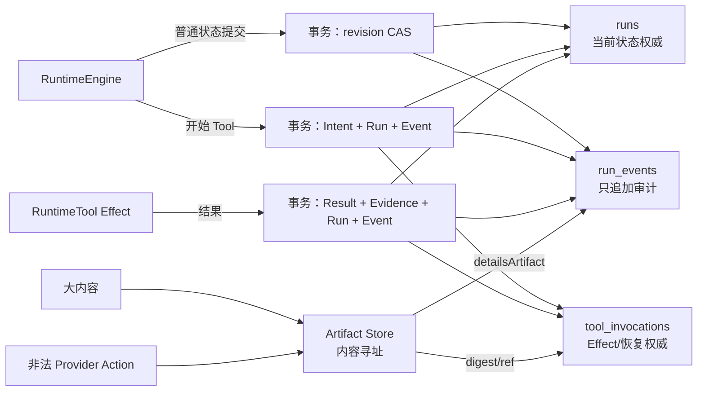
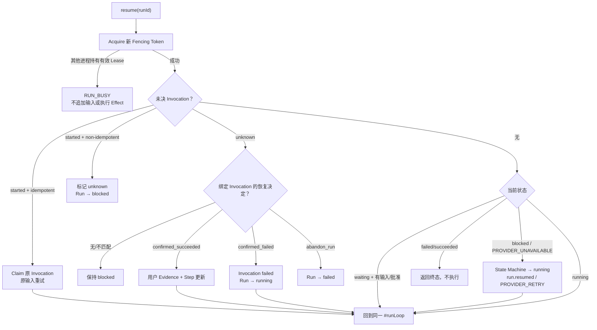

# 当前数据流与开发调试图

## 1. 主数据流

## 2. 权威与读写位置

| 数据 | 创建 | 修改 | 读取/消费 | 持久化/销毁 |
| --- | --- | --- | --- | --- |
| 自然语言输入 | CLI/调用方 | Resume 只追加 | Provider、验证 | `runs.snapshot_json.inputHistory`；不改写 |
| CLI Provider 配置 | 启动目录 `.env` 或显式进程环境 | 不修改；显式环境优先 | CLI start/resume 创建 Provider | 只存在于进程环境；不读取目标 `--cwd`，不进入 Runtime/SQLite/Event/Artifact |
| Task Contract | 首次 `set_plan` 候选 | 仅新输入时版本化 | Plan digest、Provider、验证 | Run snapshot；Zod 校验 |
| Structured Plan | Model 提议，Runtime 生成 identity | CAS 修订，完成步骤不可改 | Action 授权、Step、完成门 | Run snapshot 唯一当前版本 |
| Provider Action Contract | Runtime 从 Zod Schema、Run 状态和 Tool 定义投影 | 每轮随 Plan/Input/active Step 重建 | Provider 决策 | 进程内只读数据；不是第二权威 |
| Tool Capability Contract | Tool定义时必填五层结构 | Runtime构造时校验文本、example和Schema边界 | Model读取选择投影；Runtime读取Execution/Evidence内部字段 | 进程内静态metadata，不持久化 |
| Tool inputExample | `contract.execution`定义 | 不修改；Runtime构造时过JSON + inputSchema | 仅active Step可调用Tool的Provider context | 不单独持久化 |
| Tool Facts | Tool执行产生 | Runtime用`factsSchema`校验 | Invocation、Observation、Evidence、semantic validation | 保存在既有`tool_invocations.result_json`；不建新表 |
| Canonical Tool input | Provider Action 经 Tool Schema parse/default expansion | protected resume 从 Pending Action 重校验 | Approval UI、Invocation、Tool execute | protected Action 在 Run Pending Request；执行后以 Invocation input 为权威 |
| 被拒绝 Action | Provider 返回 | 不修改 | 下一轮修复、逆向审计 | 原始 JSON 进 Artifact；诊断/引用进 Event 与 lastError |
| Run Status | 初始 snapshot | 仅 State Machine | CLI、Resume、验收 | `runs.status` + snapshot |
| Tool Invocation | Runtime 生成 ID/digest/key/token | result/unknown/recovery 原子更新 | 恢复、完成门、语义验证 | `tool_invocations` |
| Tool Observation | Runtime 从当前 Run completed Invocation 投影 | 每轮重建；不接受 Provider 修改 | 下一轮 Provider 决策 | 最多 8 项/约 32 KiB，进程内销毁；不是 Store |
| Evidence | 成功 Tool/用户恢复确认 | Plan 修订仅保留有效证据 | Step、验证、Result | Run snapshot，绑定 Plan/Step/Check/Invocation |
| Finish Evidence 引证 | Provider `propose_finish` 提议，Runtime 解析 | 不修改；缺失/重复/未知/部分覆盖均拒绝 | 确定性完成、语义验证、Result、成功 Event | `validation.requested/passed` 与 Result 保存同一 ID 集；不是第二 Evidence Store |
| Event | Store 成功提交时追加 | 永不修改 | observer、inspect、审计 | `run_events`；不是状态源 |
| Artifact | 大内容按 SHA-256 创建 | 不修改 | Tool result/ref、人工审计 | `.nexora/artifacts` |
| Lease/Fencing | start/resume acquire | 操作前及长调用中 renew | 所有写事务校验 | `runs` lease 列；release 清空 |

## 3. 三表与事务边界

事务原则：Intent 与结果分成两个事务，使进程中断后能够区分“尚未开始”“结果明确”和“结果未知”；任何孤立 Artifact 都不能改变 Run 状态。

## 4. Resume 与恢复流

## 5. 开发时如何使用数据流图

1. 在图上标出症状最后出现的节点。
2. 向上游找到最后一个已持久化的权威事实。
3. 比较下一节点所需输入与实际 snapshot/Event/Invocation。
4. 在该边界写 RED；不要在下游增加补偿状态。
5. 修复后同时验证正向路径和 Resume/失败分支，确保没有第二个真相源。

Provider Action Contract 是每轮从权威数据重新投影的进程内对象，`RuntimeEngine.close()` 后销毁；它不进入新表，也不能反写 Run。SQLite 和 Artifact 保留。1.1 不读取旧数据库、Checkpoint 或 Ledger。

Tool Observation 采用同一原则：`tool_invocations.result_json/error_json` 是唯一权威，Context 只带 completed Invocation 的结果、关联 metadata、稳定 digest 和必要 preview，不复制 input、幂等键、Fencing 或 Lease。`filesystem.read` 的结果内另含内容 digest，供后续 patch 直接复制；大文件正文仍进入 Artifact。

Tool capability 与 input 也不建立第二权威：description/inputExample 都来自已注册 `RuntimeTool`；description 每轮可见但有 240 字符上限，inputExample 仅 active callable Tool 可见。真正执行 input 只由 Tool 自身 Zod Schema 生成，protected Pending Action 保存默认值已展开的 canonical JSON；resume 不信任内存缓存，重新 parse 后才创建 Invocation。

完成投影同样不持久化第二份状态：finish IDs 只在 `validateCompletion` 中解析到 `RunSnapshot.evidence`，随后同一 ID 集进入 semantic Context、validation Event、Result 和成功转换。进程退出后，可从 Result 与 Event 反向重建这条引证链。

E055 搜索数据流不创建新 authority：canonical Tool input 从 Pending/Invocation 进入同一个 `filesystem.search`，workspace `path` 先经边界校验；Ripgrep 只产生进程内 JSON 事件，映射为有界、排序的 `matches/truncated` 后写入原 Invocation result。原始 stdout 随函数返回销毁，不入新表；后续 Provider observation、Evidence、finish 与验证仍从 Invocation/Run 权威读取。

E058 需求流为 `inputHistory → 模型TaskContract/Plan → Runtime结构/权限执行 → Invocation/Evidence → 对照全部inputHistory的semantic validation`。Runtime不创建第二份自然语言需求投影；semantic失败复用原循环修订Plan，安全Effect仍由risk/Approval确定性控制。

E059结果显示流为 `propose_finish.summary → semantic validation → RunSnapshot.result.summary → toRunResult只读投影 → Runtime调用方/CLI JSON`。创建、验证和持久化仍只有一份Result；`summary`没有在CLI复制、修改或销毁，未产生Result时投影为`null`。

E060验证流为 `全部inputHistory + proposedSummary + cited Evidence关联Invocation → 进程内plain facts → semantic verdict(passed/issues)`。facts和verdict不持久化第二份Evidence authority；成功仍使用`validateCompletion`产生的Evidence IDs进入validation Event、Result和State Machine，facts在调用后销毁。

E061工具流为`注册时五层Contract校验 → Model读取选择投影 → active inputExample → Runtime inputSchema/canonical Action → Tool执行单一Capability → success factsSchema → 原tool_invocations.result_json → Evidence/observation/semantic facts`。数据库列未改名或迁移；`result_json`仍是持久化权威，`facts`是运行时语义名称。非法Facts转为failed Invocation且不产生Evidence。

E062–E064交互流为`TTY CLI → start → waiting Pending Action → 显示精确Action → y或拒绝原因 → 同一Runtime.resume`。人工等待不进入活跃段Duration；拒绝原因同时进入Approval Event、lastError和inputHistory，下一轮Task Contract/Decision/semantic validation从同一输入权威读取。没有Feedback Store。

E065–E076没有增加第二条执行流：Provider decide/validate 每次最多三次无副作用 HTTP 尝试，耗尽后用现有 blocked 状态；`PROVIDER_UNAVAILABLE` resume 经 State Machine 回到同一 loop，并继续使用 persisted Invocation/Evidence。拒绝后立即进入 input waiting；已持久化同一 Invocation 幂等键的 Action 在 Approval/Effect 前进入既有有界修复；跨进程 resume 由同一 Lease/Fencing 拒绝；Provider 只通过当前 Tool `inputExample` 生成 workspace-relative input。E076 固定 UAT 的十二个 Run 全部通过，并已反查三表、Artifact 与 Git。
