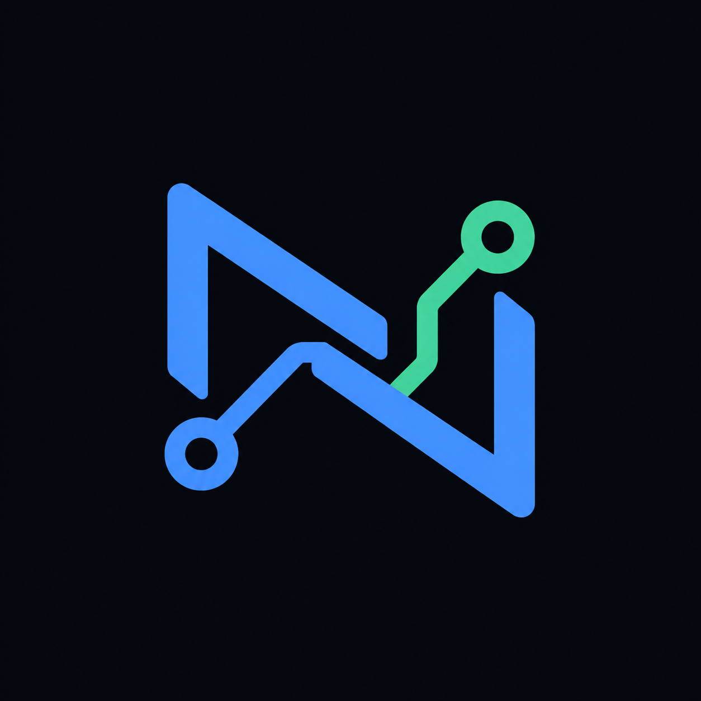
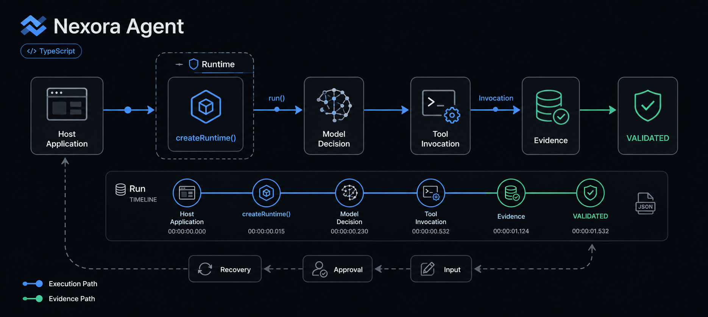
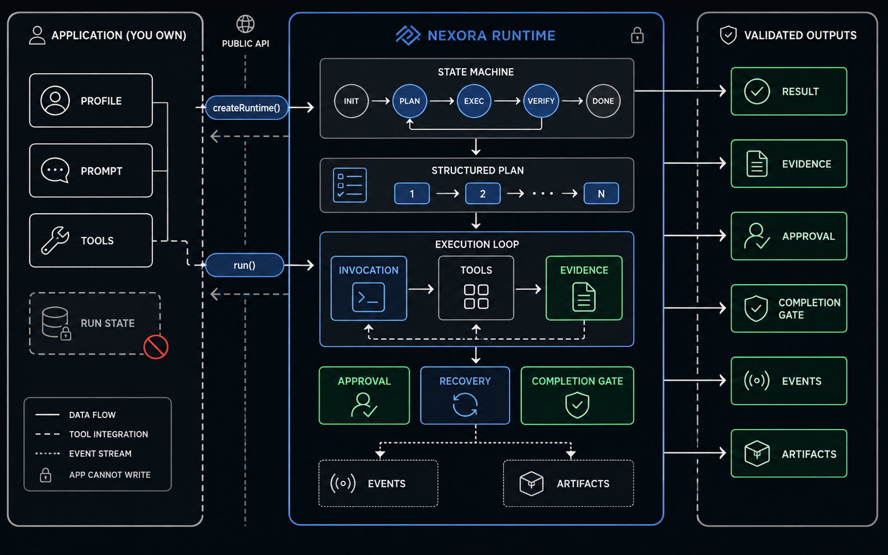

<p align="right"><strong>English</strong> · <a href="./README.zh-CN.md">简体中文</a></p>

<p align="center">
  
</p>

<h1 align="center">Nexora Agent</h1>

<p align="center"><strong>The trusted execution layer beneath your Agent application.</strong></p>

<p align="center">
  Build with your own model, tools, prompts, and product experience.<br>
  Let Nexora make every run persistent, controllable, recoverable, and verifiable.
</p>

<p align="center">
  
  
  
  
  
  
</p>

<p align="center">
  
</p>

## The execution layer beneath your Agent

An Agent product has four distinct responsibilities:

| Layer | Responsibility |
| --- | --- |
| **Your application** | Defines the goal, domain prompts, tools, data, UI, and product behavior. |
| **Nexora Harness** | Owns the Agent Loop, general prompt compiler, versioned Agent Profiles, context, Memory policy, planning, Provider transport, and ModelTurn compilation. |
| **The model Provider** | Receives bounded Harness requests and proposes what the Agent should do next. |
| **Nexora Runtime** | Executes approved commands safely and owns durable state, Tool Invocations, recovery, Evidence, and the mechanical completion gate. |

Nexora supplies the Harness and Runtime layers. It is not another Agent persona and it does not replace your application framework. The Harness turns model responses into Runtime commands; the Runtime turns those commands and Tool effects into one durable, auditable **Run**.

"Mechanical" means deterministic code, not another LLM judgment. Runtime never calls a Provider: it validates schemas and permissions, records Invocations and Evidence, enforces state transitions and completion invariants, and persists the result. Harness owns every model call and semantic decision.

```text
goal
  → model decision
  → Tool Invocation
  → persisted Evidence
  → next decision or human interaction
  → validated terminal Result
```

Without a runtime, every application eventually rebuilds its own state flags, retry rules, approval flow, partial-progress storage, and definition of “done.” Nexora provides one execution path for those concerns while leaving all domain behavior in the application.

## Why use Nexora?

Use Nexora when an Agent must do more than return one model response:

- **It performs real actions.** Tool calls are schema-validated and recorded as authoritative Invocations.
- **It may need a person.** Input, approval, and denial pause and continue the same Run.
- **It must survive interruption.** Persisted state allows a Run to be reopened after a process restart.
- **It cannot repeat side effects blindly.** Recovery distinguishes safe retry from unknown non-idempotent effects.
- **Its result must be defensible.** Evidence and the Completion Gate prevent plausible model text from impersonating success.
- **It distinguishes grounded replies from executed work.** The Harness may answer directly from authoritative context, while workspace or external work still requires real Tool Evidence.
- **It can delegate bounded work.** A Supervisor can coordinate isolated Child Runs without giving Workers authority over the Parent.
- **It lives inside a real product.** Nexora embeds through a TypeScript API and does not take ownership of domain data or UI.

For a simple stateless chat completion, Nexora may be unnecessary. It is designed for Agents whose execution has state, side effects, human interaction, or a meaningful completion contract.

Original user inputs remain visible throughout the Run; a model-authored Task Contract or Plan cannot replace them. The Harness directs uncertainty through existing facts, Tools, bounded retry, and alternate paths before asking the user. A first input request made before any Tool attempt is returned to the model once for autonomous correction when Tools are available; genuinely user-owned choices still pause the Run.

Every terminal or externally blocked Run exposes a user-readable **Delivery**. A successful Delivery uses the validated model result. Failed, cancelled, and blocked Runs receive a deterministic Delivery that reports produced artifacts, confirmed facts, unfinished work, the exact cause, and the next action without relabeling partial progress as success.

## Bounded multi-agent coordination

Nexora supports Supervisor/Coordinator execution through durable Parent and Child Runs. The Parent delegates one bounded batch of independent assignments; each Worker receives an isolated branch workspace, explicit Tool allowlist, profile and budget. Workers cannot delegate again, mutate the Parent workspace directly, or declare the Parent complete.

```text
Parent decision
  → bounded Worker batch
  → isolated Child Runs and branch workspaces
  → durable join and failure containment
  → Child observations returned to Parent
  → normal Tool / Approval / Evidence adoption path
```

Crash recovery reopens the accepted Child Runs instead of asking the model to delegate them again. A blocked, waiting or failed Child remains inspectable, while successful Worker output affects the Parent only when the Parent adopts it through the same Runtime authority and safety gates as any other action.

## General prompt and Agent Profiles

Nexora compiles every model request from a stable general kernel, one Provider transport, Host Policy, an optional versioned Agent Profile, Project Instructions, canonical Tool JSON Schemas, and dynamic Run context. Profiles describe role, strategy, workflow, and communication preferences. They cannot register Tools, grant permission, approve effects, create Evidence, or declare a Run complete.

The stable strategy prefix is digested and audited on every Model Call. Provider cache telemetry records eligible, cached, and write tokens plus `unsupported`, `disabled`, `miss`, `partial_hit`, `hit`, or `unknown`; only explicitly comparable Provider measurements enter the cached-input ratio. Cache reuse never skips a Provider call or any Runtime gate.

## Context: a bounded view of durable Run state

Nexora does not treat the model prompt as the Agent's memory or source of truth. On every Provider call, the Harness rebuilds a bounded **Agent Working Context** from Runtime authority: the current input and task contract, the Run-owned Plan and progress, relevant Tool Observations, Evidence, interaction state, and recovery facts. The projection is disposable; deleting it cannot delete or rewrite what actually happened.

```text
persisted Run authority
  → bounded working projection
  → token measurement
  → deterministic eviction when needed
  → exact fact rehydration
  → bounded Provider request
```

| Mechanism | How it works |
| --- | --- |
| **Bounded projection** | Decision calls receive one task-focused working context while retaining every original user input and the latest relevant Tool outcomes. Internal IDs, versions, workspace details, full Plan structure, and unrelated provenance stay off the production wire. |
| **Measured token budget** | The final serialized request is checked against the Provider profile's soft and hard limits. The Harness contracts rebuildable context deterministically before dispatch; if the irreducible Inputs and required authority still exceed the hard limit, it makes no Provider call and persists a resumable `CONTEXT_CAPACITY_EXCEEDED` block. |
| **Deterministic eviction** | Lower-value Tool payloads shrink from full content to fragment, reference, or omission using stable priority rules. Active checks, unresolved failures, safety facts, Evidence, and current work remain ahead of ordinary history. No LLM decides what to evict. |
| **History navigation and rehydration** | Bounded `historyCandidates` are internal Harness navigation metadata and are not sent by the production Adapter. The Harness restores published refs named by the latest input, active `context_ref` requirements, the highest-ranked eligible Memory, and critical Tool facts into digest-checked `rehydratedFacts`; unavailable, altered, or oversized facts remain typed unavailable data instead of being guessed or stopping the Run. |
| **Restart and branch isolation** | Context is rebuilt from persisted authority after restart. A branch inherits a read-only fork base but owns its workspace, history, Evidence, and completion state, so it cannot mutate or complete its parent. |

The ordering is deliberate: current task and authoritative Evidence first, rebuildable history second. Context management may change what the model can see in one call, but it cannot change Run Status, Plan, Invocation, Evidence, Approval, or the Completion Gate.

## Memory: scoped, durable knowledge across Runs

Memory is separate from the Run Store. The host opens a dedicated Memory Store and injects an exact identity scope: `userId`, `projectId`, `workspaceId`, and optional branch. Records preserve their source Run, source ref, digest, type, verification state, sensitivity, lifecycle, and timestamps. Memory can help a later Run recover relevant knowledge, but it never becomes a second Plan, task state, permission system, or truth authority.

```text
Run-derived candidate
  → explicit or verified promotion
  → scoped active Memory
  → bounded candidate navigation
  → eligibility + digest recheck
  → untrusted rehydrated fact
  → normal Tool / Approval / Evidence path
```

| Mechanism | How it works |
| --- | --- |
| **Lifecycle and provenance** | New knowledge begins as a candidate. Explicit or evidence-backed promotion can make it active. Corrections and merges create a new record and supersede predecessors transactionally; statements are not silently edited in place. Records may also expire, be archived, invalidated, or deleted. |
| **Exact scope isolation** | Every create, query, update, recall, and audit operation includes the full scope. Cross-user, cross-project, cross-workspace, sibling-branch, sensitive, expired, deleted, or disabled records are not eligible for recall. |
| **Bounded candidate projection** | The Harness deterministically ranks active, relevant, normal-sensitivity records and exposes at most 6 candidates within 768 estimated tokens and 4 KiB. Candidates contain refs, types, reasons, lifecycle and digest metadata, not the Memory statement itself. |
| **Exact restoration** | Before use, Nexora rechecks scope, lifecycle, expiry, sensitivity, and digest, then restores the selected record as `rehydratedFacts(kind="memory")`. A deleted or changed record becomes unavailable rather than leaking stale content. |
| **Untrusted by construction** | Restoring exact bytes proves provenance, not authority. Memory content is labeled untrusted data and cannot override policy, request Tools, bypass Approval, manufacture Evidence, or declare completion. Any action suggested by recalled content still follows the normal Runtime gates. |
| **User control and audit** | Hosts can correct, invalidate, delete, clear, export audit history, or disable recall for an exact scope. Control operations are idempotent and append audit events without copying sensitive statement text. |

Context answers **what this model call needs from the current Run**. Memory answers **what eligible knowledge from earlier Runs may be useful now**. They meet only through bounded candidates and verified rehydration; neither creates a second execution authority.

## Proved under pressure: Context & Memory Harness

Nexora includes a reproducible Harness for the failure modes that usually appear only after an Agent has been running for a while: context eviction, cross-run Memory recall, same-run history recovery, untrusted recalled content, token pressure, and evidence-backed completion.

| Gate | What it exercises | Current verified baseline |
| --- | --- | --- |
| **Deterministic Harness v2** | 13 fixed scenarios across continuity, budget, safety, recovery, and completion; no external model calls | **13 / 13 passed** |
| **Real Provider Harness** | HPE-01–05 against a real OpenAI-compatible Provider, repeated 3 times per scenario | **15 / 15 passed** |

The Provider gate does more than compare final text. It evaluates persisted Run state, requested and restored refs, Tool Invocations, Evidence, token usage, and unsafe actions. Missing runs, skipped evidence, duplicate scenario keys, false success, hard token-limit violations, or unsafe Invocation paths fail the aggregate report closed.

```powershell
# Fast, deterministic regression baseline
pnpm benchmark:context-memory:v2

# Real Provider baseline; reads Provider configuration from .env
$env:NEXORA_PROVIDER_BENCHMARK_CONFIRM = '15'
pnpm benchmark:context-memory:provider
```

The checked baseline uses `qwen3.7-flash`; Provider cost is intentionally reported as unpriced unless explicit token pricing is configured. The Harness measures Nexora's own execution contracts, not comparative performance against other Agent systems.

## Core concepts

| Concept | What it means |
| --- | --- |
| `Agent` | The `createAgent()` composition of Harness strategies, Provider, Tools, and one Runtime. |
| `Runtime` | The Provider-free mechanical engine for durable Run state, effects, recovery, and completion invariants. |
| `Run` | One durable attempt to achieve a goal. Its State Machine is the only authority allowed to change Run status. |
| `RunHandle` | The public control surface used by a host to observe events, provide input or approval, cancel, resume, and read the result. |
| `Provider` | The model adapter that proposes decisions. It cannot execute Tools or write Run state directly. |
| `Tool Invocation` | The authoritative record of a requested real-world action and its execution outcome. |
| `Evidence` | Persisted proof used to validate progress and determine whether completion is justified. |

The current Structured Plan belongs to the Run. The application does not maintain a second plan, second state machine, or second source of truth for execution.

## Quick start

> Nexora Agent `0.1.0` is a release candidate and is not yet published to npm. Start from the source workspace or locally packed tarballs.

Requirements: Node.js 20+ and pnpm 11.

```powershell
git clone https://github.com/Atman-Angle/Nexora-Agent.git
Set-Location -LiteralPath 'Nexora-Agent'
pnpm install
pnpm typecheck
```

### Open the Desktop Agent Workspace

Install dependencies and run Nexora Desktop. You can configure a global Provider/model in Settings after launch; an existing root `.env` with `NEXORA_MODEL_BASE_URL`, `NEXORA_MODEL_API_KEY`, `NEXORA_MODEL_NAME`, and `NEXORA_MODEL_DECISION_OUTPUT_TOKENS` is imported for compatibility:

```powershell
pnpm desktop
```

Desktop is a two-column Runtime host: Projects (Workspaces) and Sessions on the left, and one Conversation/Activity execution surface in the center. OpenAI-compatible `native_tools` Providers can stream explicitly returned `content` and `reasoning_content` into the Conversation as non-authoritative process text, while Tool, Evidence, Validation, and completion still come from Runtime authority; public output and Results render safe Markdown. Enter sends, Shift+Enter adds a line, and the Composer remains available while a Run is active and after it terminates. Settings manages one global Provider/model catalog, including multiple models per Provider; each Project selects the profile used by future Runs without interrupting active Runs. One Desktop installation can manage any added local Workspace.

Run the real-Provider Electron acceptance path with `pnpm desktop:uat`. See the [Desktop usage and verification guide](apps/desktop/README.md) for configuration, interaction states, test commands, UAT artifacts, and current release gates.

Create a Runtime, start a Run, and wait for its validated result:

```ts
import {
  createBuiltInTools,
  createAgent,
  openAICompatibleProviderFromEnv
} from "@nexora/harness";

const runtime = createAgent({
  workspace: "D:/my-agent-workspace",
  provider: openAICompatibleProviderFromEnv(),
  tools: createBuiltInTools()
});

try {
  const run = runtime.run("Read note.txt and produce an evidence-backed summary");
  const result = await run.result();

  console.log(result.status, result.summary);
} finally {
  await runtime.close();
}
```

`runtime.run()` returns a `RunHandle`, not an unverified model answer. Interactive hosts can use that same handle to continue the Run:

```ts
const subscription = run.subscribe(async (event) => {
  if (event.type === "input.required") {
    await run.input(await askUser(event.prompt), {
      requestId: event.requestId
    });
  }

  if (event.type === "approval.required") {
    await run.approve({ requestId: event.request.id });
  }
});
```

See [Build with the Nexora Runtime](docs/BUILD_WITH_NEXORA_RUNTIME.md) for packaging, Provider adapters, custom Tools, events, cancellation, and recovery.

## What happens during a Run?

1. `runtime.run(goal)` creates and persists a new Run.
2. The Provider observes the Run context and proposes the next decision.
3. A Tool request is validated and, when required, waits for approval.
4. Nexora records the Tool Invocation and its Evidence before continuing.
5. Input, failure, cancellation, or restart is handled through the same persisted Run.
6. The Completion Gate checks persisted Evidence and, when present, the Run-owned plan before the State Machine can mark the Run as succeeded.

<p align="center">
  
</p>

The boundary is intentional: the model, Tool, and host application cannot write Run status directly. This keeps execution state, side effects, recovery decisions, and completion under one authority.

## Reference harness: Research Agent

[`apps/research-agent`](apps/research-agent) is a real application harness built on Nexora's public API. Research Profiles, Tavily integration, news Tools, scheduling, and generated content remain application-owned; Nexora owns the Run lifecycle beneath them.

```ts
const runtime = createAgent({ workspace, provider, tools });
const run = runtime.run(buildResearchGoal(profile));
const result = await run.result();
```

The harness verifies real retrieval, human interaction, failure recovery, and deterministic completion without reading the Core Store, writing Run state, copying CLI orchestration, or adding Research-specific branches to Core.

**[Explore the complete Research Agent setup, outputs, and live execution evidence →](docs/applications/research-agent.md)**

## Repository

```text
Nexora-Agent/
├─ packages/
│  ├─ harness/                       # Agent Loop, Provider, Context, Memory
│  └─ runtime/                       # Reliable Effect Runtime
├─ apps/
│  ├─ cli/                           # Thin command-line host
│  ├─ desktop/                       # Official two-column Desktop Agent Workspace
│  └─ research-agent/                # Real application Harness
├─ examples/
│  └─ runtime/                       # Public API usage examples
├─ tests/
│  ├─ apps/                          # Host application contracts
│  ├─ benchmarks/                    # Deterministic and real Provider Harnesses
│  ├─ canaries/                      # Real Provider continuity canary
│  ├─ fixtures/                      # Shared deterministic test data
│  └─ runtime/                       # Runtime and Harness contracts
├─ docs/                             # Public guides and validation references
└─ assets/readme/                    # GitHub README visuals
```

## Documentation

- [Desktop usage and verification](apps/desktop/README.md)
- [Desktop Workspace feature specification](docs/NEXORA_DESKTOP_WORKSPACE_SPEC.md)
- [Build with the Nexora Runtime](docs/BUILD_WITH_NEXORA_RUNTIME.md)
- [Research Agent harness and results](docs/applications/research-agent.md)
- [Context Harness system validation](docs/CONTEXT_HARNESS_SYSTEM_VALIDATION.md)
- [Architecture and authority boundaries](ARCHITECTURE.md)
- [System data flow](DATA_FLOW.md)
- [Testing strategy](TESTS.md)

## Project status

Nexora Agent `0.1.0` is an Apache-2.0 licensed release candidate. Runtime, Harness, Multi-Agent coordination, CLI, Research Agent, and Context & Memory validation can be built and tested in this repository. Public npm publication and long-running hosted deployment have not yet been completed.

```powershell
pnpm typecheck
pnpm lint
pnpm build
pnpm test
```

Licensed under the [Apache License 2.0](LICENSE).
