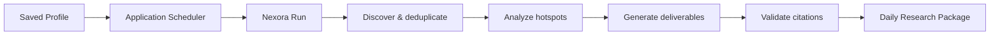

# Nexora Agent

**A trusted runtime for building reliable Agent applications.**

Nexora Agent 是一个可嵌入 Node.js / TypeScript 应用的 Agent Runtime。你负责模型、Tool 和产品体验，Nexora 负责执行过程中的状态、持久化、交互、失败恢复与完成验证。


<!--
VISUAL SLOT: assets/readme/hero.webp
Generation prompt: assets/readme/prompts.md#1-hero
After generating, add a centered, full-width image here with the alt text documented in the prompt catalog.
-->

## Build the Agent, not another runtime

一个真实 Agent 应用不仅要调用模型和 Tool，还要处理运行状态、人工批准、异常中断、重复副作用、恢复和结果验证。Nexora 把这些能力放进同一条可信执行链，让应用代码回到真正有差异的领域部分。

| 你的应用专注于 | Nexora 提供 |
| --- | --- |
| 领域 Prompt 与 Tool | 持久化 Run 与唯一 State Machine |
| 模型与数据来源 | Structured Plan 与上下文执行 |
| 用户交互与产品界面 | Input、Approval 与类型化事件 |
| 领域结果和展示方式 | Invocation、Evidence 与 Artifact |
| 何时发起任务 | 幂等副作用、失败恢复与 Completion Gate |

Nexora 不是聊天 UI、托管 Agent SaaS 或垂直应用框架。它作为 TypeScript Runtime 嵌入宿主进程，不要求特定 Web 框架，也不把业务数据收进 Core。

## How it works

应用通过公共 API 创建 Runtime，随后用 `RunHandle` 启动、观察和控制一次执行：

```text
Host Application
  → createRuntime({ provider, tools, workspace })
  → runtime.run(goal)
  → RunHandle: events / input / approval / resume / result
  → validated terminal Result
```

执行过程中，模型只能提出决策；Tool 副作用必须形成 Invocation，完成结论必须经过 Evidence 和 Completion Gate。模型文本、Plan 结束或单个 Tool 成功都不会被直接解释为任务成功。

<!--
VISUAL SLOT: assets/readme/runtime-architecture.webp
Generation prompt: assets/readme/prompts.md#2-runtime-architecture
After generating, add a centered, full-width image here with the alt text documented in the prompt catalog.
-->

### Core capabilities

- **Persistent runs** — Run、事件和结果可在进程重启后重新打开。
- **Controlled side effects** — Tool 调用通过 Schema、Approval、Invocation 和 Evidence 执行。
- **Human interaction** — 输入、批准和拒绝通过同一个 `RunHandle` 继续当前 Run。
- **Recovery semantics** — 已知失败可以恢复；未知的非幂等副作用不会被冒险重放。
- **Verified completion** — 只有满足完成 Contract 的 Run 才能进入成功终态。
- **Application boundaries** — Prompt、Tool、业务数据和领域结果始终属于宿主应用。

## Quick start

> Nexora Agent 目前处于 pre-release 阶段，尚未发布到 npm。下面从源码工作区开始。

要求：Node.js 20+、pnpm 11。

```powershell
git clone https://github.com/Atman-Angle/Nexora-Agent.git
Set-Location -LiteralPath 'Nexora-Agent'
pnpm install
pnpm typecheck
```

创建并运行第一个 Agent：

```ts
import {
  createBuiltInTools,
  createRuntime,
  openAICompatibleProviderFromEnv
} from "@nexora/runtime";

const runtime = createRuntime({
  workspace: "D:/my-agent-workspace",
  provider: openAICompatibleProviderFromEnv(),
  tools: createBuiltInTools()
});

try {
  const run = runtime.run("读取 note.txt，并给出有证据的摘要");
  const result = await run.result();

  console.log(result.status, result.summary);
} finally {
  await runtime.close();
}
```

`runtime.run()` 立即返回 `RunHandle`。交互型宿主可以订阅事件、提交输入或批准；服务型宿主可以等待结果，并在重启后通过 `openRun()` 重新打开原 Run。

```ts
const subscription = run.subscribe(async (event) => {
  if (event.type === "input.required") {
    await run.input(await askUser(event.prompt), {
      requestId: event.requestId
    });
  }

  if (event.type === "approval.required") {
    await run.approve({ requestId: event.request.id });
  }
});
```

更多接入方式见 [Build with the Nexora Runtime](docs/BUILD_WITH_NEXORA_RUNTIME.md)。

## Case study: Automated Research Agent

仓库内的 Research Agent 展示了一个真实应用怎样在不复制 Runtime 的情况下完成自动化热点研究。

用户只需保存一次 `ResearchProfile`：配置关注领域、关键词、排除项、时间窗口、来源策略、输出类型和每日执行时间。应用侧 Scheduler 之后每天自动发起任务，直接生成所需内容，不要求用户每天重新选择热点。

```ts
const profile: ResearchProfile = {
  id: "ai-daily-brief",
  name: "AI 行业每日热点",
  topics: ["人工智能", "AI Agent", "芯片", "机器人"],
  keywords: ["大模型最新动态", "AI Agent 产品新闻"],
  excludeKeywords: ["招聘", "广告"],
  lookbackHours: 24,
  maxHotspots: 6,
  minimumSources: 2,
  reviewMode: "automatic",
  outputs: ["article", "ideas", "script", "monitor"],
  platforms: ["微信公众号", "视频号"],
  schedule: { cron: "0 8 * * *", timezone: "Asia/Shanghai" }
};
```

每天的应用流程是：



### What it produces

- 带来源引用的自媒体文章；
- 包含角度、受众和内容价值的选题建议；
- 可直接拍摄的口播与分镜脚本；
- 特定领域的新增事实、趋势、冲突和未知项分析。

“全部热点”指配置来源在指定时间窗口内返回并通过过滤的候选，不代表穷尽整个互联网。来源失败、时间缺失和覆盖范围都会被明确记录。

<!--
VISUAL SLOT: assets/readme/research-agent-proof.webp
Generation prompt: assets/readme/prompts.md#3-research-agent-proof-board
After generating, add a centered, full-width image here with the alt text documented in the prompt catalog.
-->

### It uses Nexora through the public API

Research Agent 依赖工作区公共包 `@nexora/runtime`。应用把自己的 Profile、新闻来源和领域 Tool 交给 `createRuntime()`，再用 `runtime.run()` 启动每日任务：

```ts
export function createResearchAgent(options: ResearchAgentOptions) {
  const runtime = createRuntime({
    workspace: options.workspace,
    provider: options.provider,
    tools: createResearchTools(options.sources, options.profile)
  });

  return {
    runtime,
    runDaily(now = new Date(), runOptions?: RunOptions) {
      return runtime.run(buildResearchGoal(options.profile, now), runOptions);
    },
    close: () => runtime.close()
  };
}
```

Scheduler 只决定“哪个 Profile 现在到期”，并用应用侧 Claim 保证同一 Profile 在同一业务日期只创建一个 Run：

```ts
const scheduler = createResearchScheduler({
  store,
  runWorkspaceDirectory: "D:/research-app/runs",
  createAgent: ({ profile, workspace }) => createResearchAgent({
    profile,
    workspace,
    provider,
    sources
  })
});

await scheduler.tick();
```

它没有读取 Core Store、直接写 Run、复制 CLI 执行循环或实现第二套 State Machine。Scheduler Claim 只负责每日业务幂等；Run Status、Invocation、Evidence、失败恢复和最终 Result 仍由 Nexora Runtime 拥有。

可审计实现：

- [`apps/research-agent/src/index.ts`](apps/research-agent/src/index.ts) — Profile、领域 Tool 与 `createRuntime()` 接入；
- [`apps/research-agent/src/scheduler.ts`](apps/research-agent/src/scheduler.ts) — Profile 持久化、每日 Claim 和产物归档；
- [`docs/applications/research-agent.md`](docs/applications/research-agent.md) — 完整设计、失败恢复和应用边界。

### Real end-to-end result

一次真实 Tavily + 真实模型的 Scheduler Run 从 48 条原始新闻中得到 46 条去重结果，通过 3 次 Tool Invocation 和 3 条 Evidence，最终同时生成文章、选题、脚本和领域追踪分析，并以 `VALIDATED` 完成。

| Corpus | Execution | Deliverables | Result |
| --- | --- | --- | --- |
| 48 raw / 46 unique | 3 Invocations / 3 Evidence | article / ideas / script / monitor | `run.succeeded` |

完整机器报告和正文产物位于 [`reports/canaries/2026-08-01T11-13-22-180Z-research-scheduler-one-shot.json`](reports/canaries/2026-08-01T11-13-22-180Z-research-scheduler-one-shot.json)。

### Run the Research Agent once

从仓库根目录创建 `.env`：

```powershell
Copy-Item -LiteralPath 'apps/research-agent/.env.example' -Destination '.env'
```

```dotenv
TAVILY_API_KEY=tvly-...
NEXORA_MODEL_PROVIDER=openai-compatible
NEXORA_MODEL_BASE_URL=https://your-provider.example/v1
NEXORA_MODEL_API_KEY=...
NEXORA_MODEL_NAME=...
NEXORA_MODEL_TIMEOUT_MS=180000
```

执行一次 Scheduler 驱动的真实任务：

```powershell
node --import tsx apps/research-agent/canaries/scheduler-live-e2e.ts
```

报告会写入 `reports/canaries/`。该入口运行到一次任务终态后退出，不启动长期驻留服务，也不会自动发布到第三方平台。

## Repository

```text
Nexora-Agent/
├─ packages/runtime/                 # Public trusted Runtime
├─ apps/cli/                         # Thin CLI host
├─ apps/research-agent/
│  ├─ src/                           # Profile, Tools and Scheduler
│  └─ canaries/                      # Live end-to-end runners
├─ tests/                            # Runtime and application contracts
├─ docs/                             # Guides and application documentation
├─ reports/canaries/                 # Machine-readable live evidence
└─ assets/readme/                    # README visual prompts and assets
```

## Documentation

- [Build with the Nexora Runtime](docs/BUILD_WITH_NEXORA_RUNTIME.md)
- [Research Agent guide](docs/applications/research-agent.md)
- [Architecture and authority boundaries](ARCHITECTURE.md)
- [System data flow](DATA_FLOW.md)
- [Testing strategy](TESTS.md)
- [Current development state](DEVELOPMENT.md)
- [README visual prompts](assets/readme/prompts.md)

## Project status

Nexora Agent 目前处于 pre-release 阶段。Runtime、CLI 和 Research Agent 可在本仓库中构建和测试，但 npm 发布、长期托管服务与开源许可证尚未完成或声明。

```powershell
pnpm typecheck
pnpm lint
pnpm build
pnpm test
```

> License 尚未声明。在采用、分发或发布前，请先确认许可证。
