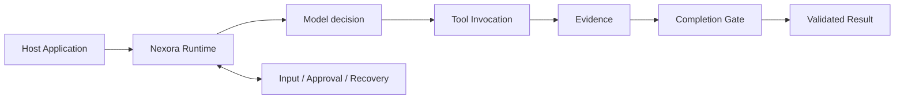

<p align="right"><strong>English</strong> · <a href="./README.zh-CN.md">简体中文</a></p>

# Nexora Agent

**A trusted runtime for building reliable Agent applications.**

Nexora Agent is an embeddable Agent Runtime for Node.js and TypeScript applications. You provide the goal, model, and tools; Nexora makes each execution persistent, interactive, recoverable, and verifiable.


<!--
VISUAL SLOT: assets/readme/hero.webp
Generation prompt: assets/readme/prompts.md#1-hero
After generating, add a centered, full-width image here with the alt text documented in the prompt catalog.
-->

## What is Nexora?

Calling a model is only the beginning of an Agent product. Production applications must also manage run state, tool side effects, human approval, process interruption, recovery, and result validation.

Nexora puts those shared concerns into one Runtime, so application code can stay focused on domain prompts, tools, data, and user experience.

| Your application owns | Nexora owns |
| --- | --- |
| Goals, prompts, and domain tools | Run lifecycle and persistence |
| Models and external data sources | Plans, Invocations, and Evidence |
| UI, schedulers, and product interactions | Input, Approval, Events, and Artifacts |
| Domain results and presentation | Recovery, concurrency control, and completion validation |

Nexora is not a chat UI, hosted Agent SaaS, or vertical application framework. It embeds into the host process through a public TypeScript API, requires no specific web framework, and does not take ownership of application data.

## Core capabilities

- **Persistent Runs** — reopen Runs, events, and results after a process restart.
- **Safe Tool execution** — execute tools through Schema, Approval, Invocation, and Evidence.
- **Human interaction** — continue the same task with input, approval, or denial through `RunHandle`.
- **Recovery** — resume known failures without blindly replaying unknown non-idempotent effects.
- **Verified completion** — model text or one successful Tool call cannot impersonate task completion.
- **Application ownership** — prompts, tools, business data, and domain results stay in the host application.

## Quick start

> Nexora Agent is currently pre-release and is not yet published to npm. Start from the source workspace.

Requirements: Node.js 20+ and pnpm 11.

```powershell
git clone https://github.com/Atman-Angle/Nexora-Agent.git
Set-Location -LiteralPath 'Nexora-Agent'
pnpm install
pnpm typecheck
```

Create a Runtime, start a Run, and wait for its validated result:

```ts
import {
  createBuiltInTools,
  createRuntime,
  openAICompatibleProviderFromEnv
} from "@nexora/runtime";

const runtime = createRuntime({
  workspace: "D:/my-agent-workspace",
  provider: openAICompatibleProviderFromEnv(),
  tools: createBuiltInTools()
});

try {
  const run = runtime.run("Read note.txt and produce an evidence-backed summary");
  const result = await run.result();

  console.log(result.status, result.summary);
} finally {
  await runtime.close();
}
```

`runtime.run()` returns a `RunHandle`. A host can use it to subscribe to events, provide input or approval, cancel or resume execution, and reopen the original Run after a restart.

```ts
const subscription = run.subscribe(async (event) => {
  if (event.type === "input.required") {
    await run.input(await askUser(event.prompt), {
      requestId: event.requestId
    });
  }

  if (event.type === "approval.required") {
    await run.approve({ requestId: event.request.id });
  }
});
```

See [Build with the Nexora Runtime](docs/BUILD_WITH_NEXORA_RUNTIME.md) for the complete integration guide.

## How it works



The Runtime owns the Run, State Machine, Structured Plan, Tool Invocation, Evidence, and Completion Gate. Models and Tools participate only through public boundaries; neither can write Run state or declare success directly.

<!--
VISUAL SLOT: assets/readme/runtime-architecture.webp
Generation prompt: assets/readme/prompts.md#2-runtime-architecture
After generating, add a centered, full-width image here with the alt text documented in the prompt catalog.
-->

## Reference harness: Research Agent

[`apps/research-agent`](apps/research-agent) is Nexora's real application harness. It keeps research Profiles, Tavily integration, news Tools, and daily scheduling on the application side, then starts and observes Runs exclusively through the public `@nexora/runtime` API:

```ts
const runtime = createRuntime({ workspace, provider, tools });
const run = runtime.run(buildResearchGoal(profile));
const result = await run.result();
```

The harness verifies that the same Runtime can support real data retrieval, interaction, failure recovery, and result validation without reading the Core Store, writing Run state, copying CLI orchestration, or adding Research-specific branches to Core.

**[Explore the complete Research Agent flow, setup, outputs, and live execution evidence →](docs/applications/research-agent.md)**

## Repository

```text
Nexora-Agent/
├─ packages/runtime/                 # Public Runtime
├─ apps/cli/                         # Thin CLI host
├─ apps/research-agent/              # Real application harness
│  ├─ src/                           # Application code
│  └─ canaries/                      # Live end-to-end runners
├─ tests/                            # Runtime and application contracts
├─ docs/                             # Guides and case studies
└─ reports/canaries/                 # Machine-readable live evidence
```

## Documentation

- [Build with the Nexora Runtime](docs/BUILD_WITH_NEXORA_RUNTIME.md)
- [Research Agent harness and results](docs/applications/research-agent.md)
- [Architecture and authority boundaries](ARCHITECTURE.md)
- [System data flow](DATA_FLOW.md)
- [Testing strategy](TESTS.md)
- [Current development state](DEVELOPMENT.md)
- [README visual prompts](assets/readme/prompts.md)

## Project status

Nexora Agent is currently pre-release. The Runtime, CLI, and Research Agent harness can be built and tested in this repository; npm publication, long-running hosted deployment, and an open-source license have not yet been completed or declared.

```powershell
pnpm typecheck
pnpm lint
pnpm build
pnpm test
```

> No license has been declared. Confirm licensing before adoption, distribution, or publication.
