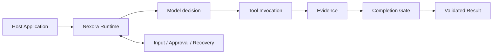

# Nexora Agent

**A trusted runtime for building reliable Agent applications.**

Nexora Agent 是一个可嵌入 Node.js / TypeScript 应用的 Agent Runtime。你提供目标、模型和 Tool，Nexora 负责让每次执行可持久化、可交互、可恢复并经过验证。


<!--
VISUAL SLOT: assets/readme/hero.webp
Generation prompt: assets/readme/prompts.md#1-hero
After generating, add a centered, full-width image here with the alt text documented in the prompt catalog.
-->

## What is Nexora?

构建 Agent 应用时，模型调用只是开始。真实产品还需要处理运行状态、Tool 副作用、人工批准、进程中断、失败恢复和结果验证。

Nexora 把这些通用问题收进一个 Runtime，让应用把代码留给真正有差异的部分：领域 Prompt、Tool、数据和用户体验。

| 应用负责 | Nexora 负责 |
| --- | --- |
| 目标、Prompt 与领域 Tool | Run 生命周期与持久化 |
| 模型和外部数据来源 | Plan、Invocation 与 Evidence |
| UI、Scheduler 和产品交互 | Input、Approval、Events 与 Artifacts |
| 领域结果与展示方式 | Recovery、并发控制与完成验证 |

Nexora 不是聊天 UI、托管 Agent SaaS 或垂直应用框架。它通过公共 TypeScript API 嵌入宿主进程，不要求特定 Web 框架，也不接管应用数据。

## Core capabilities

- **Persistent Runs** — Run、事件和结果可以在进程重启后重新打开。
- **Safe Tool execution** — Tool 调用经过 Schema、Approval、Invocation 和 Evidence。
- **Human interaction** — 输入、批准和拒绝通过同一个 `RunHandle` 继续当前任务。
- **Recovery** — 已知失败可以恢复，未知的非幂等副作用不会被冒险重放。
- **Verified completion** — 模型文本或单个 Tool 成功不能直接冒充任务完成。
- **Application ownership** — Prompt、Tool、业务数据和领域结果始终留在应用侧。

## Quick start

> Nexora Agent 目前处于 pre-release 阶段，尚未发布到 npm。下面从源码工作区开始。

要求：Node.js 20+、pnpm 11。

```powershell
git clone https://github.com/Atman-Angle/Nexora-Agent.git
Set-Location -LiteralPath 'Nexora-Agent'
pnpm install
pnpm typecheck
```

创建一个 Runtime，启动 Run，然后等待经过验证的结果：

```ts
import {
  createBuiltInTools,
  createRuntime,
  openAICompatibleProviderFromEnv
} from "@nexora/runtime";

const runtime = createRuntime({
  workspace: "D:/my-agent-workspace",
  provider: openAICompatibleProviderFromEnv(),
  tools: createBuiltInTools()
});

try {
  const run = runtime.run("读取 note.txt，并给出有证据的摘要");
  const result = await run.result();

  console.log(result.status, result.summary);
} finally {
  await runtime.close();
}
```

`runtime.run()` 返回 `RunHandle`。宿主可以用它订阅事件、提交输入或批准、取消任务、恢复执行，并在重启后重新打开原 Run。

```ts
const subscription = run.subscribe(async (event) => {
  if (event.type === "input.required") {
    await run.input(await askUser(event.prompt), {
      requestId: event.requestId
    });
  }

  if (event.type === "approval.required") {
    await run.approve({ requestId: event.request.id });
  }
});
```

完整接入说明见 [Build with the Nexora Runtime](docs/BUILD_WITH_NEXORA_RUNTIME.md)。

## How it works



Run、State Machine、Structured Plan、Tool Invocation、Evidence 和 Completion Gate 由 Runtime 统一拥有。模型和 Tool 只能通过公开边界参与执行，不能直接修改 Run 或宣布成功。

<!--
VISUAL SLOT: assets/readme/runtime-architecture.webp
Generation prompt: assets/readme/prompts.md#2-runtime-architecture
After generating, add a centered, full-width image here with the alt text documented in the prompt catalog.
-->

## Reference harness: Research Agent

[`apps/research-agent`](apps/research-agent) 是 Nexora 的真实应用 Harness。它在应用侧保存研究 Profile、连接 Tavily、定义新闻 Tool 并进行每日调度，然后只通过 `@nexora/runtime` 公共 API 发起和观察 Run：

```ts
const runtime = createRuntime({ workspace, provider, tools });
const run = runtime.run(buildResearchGoal(profile));
const result = await run.result();
```

这个 Harness 用来验证同一个 Runtime 能支持真实数据检索、交互、失败恢复和结果验证，同时不读取 Core Store、不直接写 Run、不复制 CLI 编排，也不向 Core 添加 Research 特判。

**[查看 Research Agent 的完整流程、运行方式、产物效果与真实执行证据 →](docs/applications/research-agent.md)**

## Repository

```text
Nexora-Agent/
├─ packages/runtime/                 # Public Runtime
├─ apps/cli/                         # Thin CLI host
├─ apps/research-agent/              # Real application harness
│  ├─ src/                           # Application code
│  └─ canaries/                      # Live end-to-end runners
├─ tests/                            # Runtime and application contracts
├─ docs/                             # Guides and case studies
└─ reports/canaries/                 # Machine-readable live evidence
```

## Documentation

- [Build with the Nexora Runtime](docs/BUILD_WITH_NEXORA_RUNTIME.md)
- [Research Agent harness and results](docs/applications/research-agent.md)
- [Architecture and authority boundaries](ARCHITECTURE.md)
- [System data flow](DATA_FLOW.md)
- [Testing strategy](TESTS.md)
- [Current development state](DEVELOPMENT.md)
- [README visual prompts](assets/readme/prompts.md)

## Project status

Nexora Agent 目前处于 pre-release 阶段。Runtime、CLI 和 Research Agent Harness 可在本仓库中构建和测试；npm 发布、长期托管服务与开源许可证尚未完成或声明。

```powershell
pnpm typecheck
pnpm lint
pnpm build
pnpm test
```

> License 尚未声明。在采用、分发或发布前，请先确认许可证。
